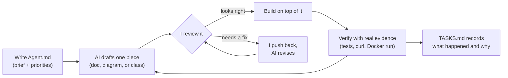

# The Unified Service Scheduler

A dealership vehicle-service appointment scheduler: customers book a service appointment for
a vehicle, service type, dealership, and time. The system validates the requested Technician
and Service Bay, checks availability against existing bookings, and confirms the appointment —
safely, even when two people try to book the same slot at the same time.

## Table of Contents

- [Architecture](#architecture)
- [Getting Started](#getting-started)
  - [Prerequisites](#prerequisites)
  - [Building](#building)
  - [Running the Application](#running-the-application)
  - [Database Migrations](#database-migrations)
  - [Testing](#testing)
    - [Unit Tests](#unit-tests)
    - [Integration Tests](#integration-tests)
    - [Manual API testing](#manual-api-testing)
      - [Postman collection](#postman-collection)
      - [Concurrency demo script](#concurrency-demo-script)
- [Deployment](#deployment)
  - [A note on the database](#a-note-on-the-database)
  - [Secrets and connection strings](#secrets-and-connection-strings)
  - [As build artifacts](#as-build-artifacts)
  - [As a Docker container](#as-a-docker-container)
- [CI/CD](#cicd)
  - [GitHub Actions](#github-actions)
  - [Dependabot](#dependabot)
- [AI Collaboration Narrative](#ai-collaboration-narrative)
  - [How I use AI](#how-i-use-ai)
  - [How I structured the requirement file](#how-i-structured-the-requirement-file)
  - [Using the C4 diagrams and data flow to structure and check the logic](#using-the-c4-diagrams-and-data-flow-to-structure-and-check-the-logic)
  - [How I verified and refined AI output](#how-i-verified-and-refined-ai-output)
  - [How I ensured final quality](#how-i-ensured-final-quality)

## Architecture

See [architecture.md](./architecture.md) for the full System Design Document — C4 diagrams,
data model, data flow, security, observability, technology choices, testing strategy, and
future evolution. [TASKS.md](./TASKS.md) tracks implementation progress task by task, if
you want to see how the project actually got built.

## Getting Started

### Prerequisites

- [.NET 10 SDK](https://dotnet.microsoft.com/download/dotnet/10.0)
- Docker, if you want to try the containerized deployment path (optional)
- The `dotnet-ef` global tool, only if you're adding a new migration:
  `dotnet tool install --global dotnet-ef`

You don't need to install a database server. This assessment uses SQLite — just a local file,
created automatically the first time you run the app. See
[A note on the database](#a-note-on-the-database) before deploying anywhere real.

### Building

```bash
dotnet restore UnifiedSeviceScheduler.sln
dotnet build UnifiedSeviceScheduler.sln --configuration Release
```

### Running the Application

```bash
dotnet run --project src/Scheduler.Api
```

By default this listens on `http://localhost:5207` and `https://localhost:7048` (see
`src/Scheduler.Api/Properties/launchSettings.json`). The first time it runs, it applies the
EF Core `InitialCreate` migration automatically — creating `scheduler.db` next to the running
executable — and seeds one dealership so there's something to book against:

| Field           | Value                                  |
| --------------- | -------------------------------------- |
| Id              | `11111111-1111-1111-1111-111111111111` |
| Name            | Downtown Dealership                    |
| Operating hours | Mon–Sat, 08:00–17:00 (closed Sunday)   |

**Endpoints:**

| Endpoint                         | Purpose                                                                          |
| -------------------------------- | -------------------------------------------------------------------------------- |
| `POST /appointments`             | Book an appointment (guest checkout — see Domain Assumptions in architecture.md) |
| `GET /appointments/availability` | Check whether a Technician/Service Bay/time slot is free, without booking        |
| `GET /health`                    | Liveness check                                                                   |
| `GET /scalar/v1`                 | Interactive API documentation (Development only)                                 |
| `GET /openapi/v1.json`           | Raw OpenAPI document (Development only)                                          |

A Postman collection (`src/Scheduler.Api/Scheduler.Api.postman_collection.json`) has ready-to-run
requests covering the happy path, every documented failure branch (400/409), and a hands-on
double-booking demo; a standalone Node.js script (`scripts/concurrency-demo.js`) reproduces the
concurrency guarantee specifically — see [Manual API testing](#manual-api-testing) under
Testing. Treat these as a manual/exploratory reference, not the automated test suite.

**Service types you can book** (see `src/Scheduler.Infrastructure/Data/servicetypes.json`):

| Code                  | Description               | Duration |
| --------------------- | ------------------------- | -------- |
| `OIL_CHANGE`          | Oil Change                | 30 min   |
| `TIRE_CHANGE`         | Tire Change / Replacement | 60 min   |
| `BRAKE_INSPECTION`    | Brake Inspection          | 45 min   |
| `INTERIOR_CLEANING`   | Interior Cleaning         | 90 min   |
| `BATTERY_REPLACEMENT` | Battery Replacement       | 30 min   |
| `WHEEL_ALIGNMENT`     | Wheel Alignment           | 60 min   |

`technicianId`/`serviceBayId` are validated against mocked external services for this
assessment, so any non-empty GUID is accepted. See architecture.md's Domain Assumptions for
why, and the plan for swapping in the real integration later.

**Configuration:**

| Setting                         | Location                                               | Purpose                                                                                                                                  |
| ------------------------------- | ------------------------------------------------------ | ---------------------------------------------------------------------------------------------------------------------------------------- |
| `ConnectionStrings:SchedulerDb` | `appsettings.json`                                     | SQLite by default — see [A note on the database](#a-note-on-the-database)                                                                |
| `Serilog:*`                     | `serilog.json`                                         | Logging sinks, output template, level overrides — kept out of `Program.cs` deliberately                                                  |
| `OpenTelemetry` OTLP endpoint   | `serilog.json` (`WriteTo:OpenTelemetry:Args:endpoint`) | Traces/metrics/logs export target; defaults to `http://localhost:4317` and fails quietly if nothing's listening — see architecture.md §7 |

### Database Migrations

EF Core migrations live under `src/Scheduler.Infrastructure/DataAccess/Migrations/`, not the
default project-root `Migrations/` folder. When you add a new migration, pass `--output-dir`
explicitly so it lands in the same place as the existing ones:

```bash
dotnet ef migrations add <MigrationName> \
  --project src/Scheduler.Infrastructure/Scheduler.Infrastructure.csproj \
  --startup-project src/Scheduler.Api/Scheduler.Api.csproj \
  --output-dir DataAccess/Migrations
```

Leave off `--output-dir` and you'll get a brand new top-level `Migrations/` folder sitting
next to the correct one — `dotnet ef` doesn't infer the location from existing migrations.

### Testing

```bash
dotnet test UnifiedSeviceScheduler.sln
```

77 tests: 64 unit tests (`tests/Scheduler.UnitTests`) covering Domain, Application, and
Infrastructure in isolation with Moq, and 13 integration tests
(`tests/Scheduler.IntegrationTests`) exercising the real HTTP pipeline against an isolated
temp SQLite database per test class, via `WebApplicationFactory`. If you're reviewing this
project and want the fastest path to confidence in it, read the subsections below in order:
Unit Tests → Integration Tests → [Manual API testing](#manual-api-testing).

#### Unit Tests

```bash
dotnet test tests/Scheduler.UnitTests
```

| Test class                                                  | Tests | Covers                                                                                                                             |
| ----------------------------------------------------------- | ----- | ---------------------------------------------------------------------------------------------------------------------------------- |
| `AppointmentSchedulingPolicyTests`                          | 10    | Domain policy: operating-hours boundaries (exactly-at-open/close, before/after), Sunday closure, cross-midnight, overlap detection |
| `CreateAppointmentCommandValidatorTests`                    | 10    | FluentValidation rules for the booking request (every required-field/empty/past-time branch)                                       |
| `TimeRangeTests`                                            | 8     | Domain value object: construction validation, `Overlaps` incl. adjacency edge cases, equality                                      |
| `CreateAppointmentCommandHandlerTests`                      | 8     | Every handler failure branch, insert-conflict → 409, notification/cache calls verified via `Moq.Verify`                            |
| `AppointmentTests`                                          | 7     | Aggregate `Create` validation, slot-count generation for 30/45/60-min durations                                                    |
| `AppointmentAvailabilityCheckerTests`                       | 7     | Every `AvailabilityStatus` branch (available, unavailable, invalid resource, outside hours, unknown service type)                  |
| `CheckAvailabilityQueryValidatorTests`                      | 5     | FluentValidation rules for the availability query                                                                                  |
| `JsonServiceTypeProviderTests`                              | 3     | JSON-backed service type catalog (known/unknown code, get-all)                                                                     |
| `MockTechnicianServiceTests` / `MockServiceBayServiceTests` | 4     | Mocked external-system existence checks                                                                                            |
| `CheckAvailabilityQueryHandlerTests`                        | 2     | Query handler happy path + unknown-service-type failure                                                                            |

**Coverage**: collection is wired up via `coverlet.collector` (`--collect:"XPlat Code
Coverage"`) and runs on every CI build (see [GitHub Actions](#github-actions)). To turn the
raw Cobertura XML into a browsable HTML report locally, this repo pins
[`dotnet-reportgenerator-globaltool`](https://github.com/danielpalme/ReportGenerator) as a
local tool (`.config/dotnet-tools.json`):

```bash
dotnet tool restore
dotnet test UnifiedSeviceScheduler.sln --collect:"XPlat Code Coverage" --results-directory ./TestResults
dotnet tool run reportgenerator \
  -reports:"TestResults/**/coverage.cobertura.xml" \
  -targetdir:"TestResults/CoverageReport" \
  -reporttypes:Html \
  -classfilters:"-Microsoft.AspNetCore.OpenApi.Generated" \
  -title:"Unified Service Scheduler - Coverage Report"
```

(The `classfilters` flag excludes ASP.NET Core's own OpenAPI source-generated code, which
would otherwise dilute the numbers with generated code nobody on this project wrote.) Open
`TestResults/CoverageReport/index.html` in a browser. CI generates and uploads this same report
as a build artifact — see [GitHub Actions](#github-actions) — so a reviewer never has to run
this locally just to see coverage.

Latest local run — 94.7% line / 72.1% branch coverage across Domain, Application, and
Infrastructure (Api's OpenAPI-generated code excluded, as above):


#### Integration Tests

```bash
dotnet test tests/Scheduler.IntegrationTests
```

`AppointmentBookingTests` (`tests/Scheduler.IntegrationTests`), via
`SchedulerApiFactory : WebApplicationFactory<Program>`, one isolated temp SQLite file per test
class instance:

| Test                                                                 | Proves                                                                                                                                                                                                      |
| -------------------------------------------------------------------- | ----------------------------------------------------------------------------------------------------------------------------------------------------------------------------------------------------------- |
| `CreateAppointment_ConcurrentRequestsForSameSlot_ExactlyOneSucceeds` | **The core requirement** — 8 genuinely parallel requests for the same slot, exactly one `201` + seven `409`s. See [Demonstrating the concurrency guarantee](#demonstrating-the-concurrency-guarantee) below |
| `CreateAppointment_ValidRequest_Returns201WithSlots`                 | Happy path — `201` plus the generated `AppointmentSlot` rows                                                                                                                                                |
| `CreateAppointment_SameSlotTwice_SecondReturns409`                   | Double-booking rejected even without a race — first booking wins, an immediate second attempt at the identical slot is rejected                                                                             |
| `CreateAppointment_OutsideOperatingHours_Returns400`                 | Time before dealership opening rejected                                                                                                                                                                     |
| `CreateAppointment_Sunday_Returns400`                                | Dealership closed Sunday rejected                                                                                                                                                                           |
| `CreateAppointment_InvalidTechnician_Returns400`                     | Unknown/invalid technician rejected                                                                                                                                                                         |
| `CreateAppointment_EmptyVehicleField_Returns400`                     | Required-field validation enforced end-to-end, not just at the unit level                                                                                                                                   |
| `CreateAppointment_SameCustomerTwice_ReusesCustomerId`               | Guest checkout dedupes by Email+Phone instead of creating a duplicate `Customer`                                                                                                                            |
| `CheckAvailability_BookedSlot_ReturnsUnavailable`                    | Availability query reflects a real booking                                                                                                                                                                  |
| `CheckAvailability_FreeSlot_ReturnsAvailable`                        | Availability query on an open slot                                                                                                                                                                          |
| `HealthCheck_ReturnsHealthy`                                         | `/health` liveness                                                                                                                                                                                          |
| `Request_WithCorrelationIdHeader_EchoesItBack`                       | Inbound `X-Correlation-Id` is honored verbatim                                                                                                                                                              |
| `Request_WithoutCorrelationIdHeader_AutoGeneratesOne`                | A fresh correlation id is minted when the header is absent                                                                                                                                                  |

**Two ways to exercise these**: automated, via `dotnet test` above (this is what CI runs on
every PR); or manually, against a real running instance of the API, using the Postman
collection — see [Manual API testing](#manual-api-testing) directly below. It maps onto the
same scenarios as the table above (happy path, 409 conflict, 400s, availability checks,
correlation-id capture) so it's a reasonable way to sanity-check the API by hand without
reading test code first.

##### Demonstrating the concurrency guarantee

`CreateAppointment_ConcurrentRequestsForSameSlot_ExactlyOneSucceeds` is the test that matters
most for this project — it's the actual proof of the core requirement (concurrency safety),
not just a claim about it. It fires 8 genuinely parallel booking requests at the same
Technician/Service Bay/time and asserts that exactly one comes back `201 Created` and the
other seven come back `409 Conflict`. Run it on its own:

```bash
dotnet test UnifiedSeviceScheduler.sln \
  --filter "FullyQualifiedName~CreateAppointment_ConcurrentRequestsForSameSlot_ExactlyOneSucceeds" \
  --logger "console;verbosity=normal"
```

The `console;verbosity=normal` logger prints a single `Passed` line for the test, which is
enough to confirm the eight-way race resolved to exactly one winner. To see it fail-safe rather
than just pass, open `tests/Scheduler.IntegrationTests/AppointmentBookingTests.cs`, find that
test, and read it alongside architecture.md §9 (Testing Strategy) and the Data Model / Data
Flow sections — they explain why it's the `UNIQUE(ResourceKind, ResourceId, SlotStart)`
constraint on `AppointmentSlot` doing the actual work here (see architecture.md's
[Concurrency Strategy](./architecture.md#concurrency-strategy) section), not the pre-insert
overlap check, which is a fast-fail UX optimization only. **Never take a green
result here as "no bugs" and stop reading** — if you want to see the guarantee actually get
exercised instead of just trusting the assertion, drop a breakpoint (or a `Console.WriteLine`)
inside `CreateAppointmentCommandHandler`'s insert path and watch seven of the eight parallel
calls hit the unique-constraint violation and get mapped to `409` while one succeeds.

Prefer to see it happen against a real running instance instead of inside the test suite? See
[Concurrency demo script](#concurrency-demo-script) below — a small Node.js script that fires
20 genuinely concurrent requests at the same slot over real HTTP and reports the same 1×`201`

- N×`409` split.

#### Manual API testing

Two purpose-built tools, for two different jobs — both need the API running first:

```bash
dotnet run --project src/Scheduler.Api
```

(the default "http" launch profile, `http://localhost:5207` — both tools below point at it by
default, no `--launch-profile` flag needed.)

- **[Postman collection](#postman-collection)** — general exploratory testing: happy path,
  validation errors, sequential double-booking. Works for anyone, no IDE required.
- **[Concurrency demo script](#concurrency-demo-script)** — the project's actual core
  requirement, specifically. A small Node.js script, not Postman, because proving requests
  genuinely race for the same slot needs real parallel dispatch (`Promise.all`), which a
  point-and-click tool can't give you.

##### Postman collection

`src/Scheduler.Api/Scheduler.Api.postman_collection.json` — import it into Postman
(File → Import, or drag the file onto the app) and you get two folders:

| Folder                      | What it demonstrates                                                                                                                                                                                                                                                                                               |
| --------------------------- | ------------------------------------------------------------------------------------------------------------------------------------------------------------------------------------------------------------------------------------------------------------------------------------------------------------------ |
| Happy Path & Validation     | The same 7 scenarios as the "happy path" rows in the Integration Tests table above — health check, create/re-check availability, repeat-customer dedupe, the two 400 branches. Each request has a `pm.test(...)` assertion, so a full Collection Runner pass gives you a pass/fail summary, not just raw responses |
| Double Booking (Sequential) | Book a slot, then immediately rebook the identical one — `201` then `409`. Proves the guarantee holds when one request finishes before the next starts — the easy case, not the project's real concurrency requirement (that's the script below)                                                                   |

**Booking times are computed, not hardcoded** — a literal date would eventually land in the
past, and re-running the collection against your own persisted `scheduler.db` would otherwise
just re-book a slot you already booked. This collection uses a **collection-level pre-request
script** (Postman → select the collection → Pre-request Script tab) that runs before every
request, computing tomorrow's date (rolling past Sunday, since the dealership is closed) and
clamping the current time-of-day into the 08:00–16:00 operating window, then storing the
results as collection variables (`pm.collectionVariables.set(...)`) that every request
references as `{{bookingStartTime}}` and friends. It recomputes on every request rather than
once — deliberately: since the whole run finishes in well under a minute and the computation
is stable within a minute, every request in one run agrees on the same times without needing
"compute once" bookkeeping.

Before running, check the `baseUrl` collection variable (Postman → select the collection →
Variables tab) matches your launch profile — defaults to `http://localhost:5207`.

##### Concurrency demo script


`scripts/concurrency-demo.js` — this is the project's core requirement, reproduced by hand
against a real running instance instead of inside the test suite. It fires 20 genuinely
concurrent booking requests (real parallel HTTP dispatch via `Promise.all`, not a human
clicking through Postman tabs) at the identical Technician/Service Bay/time and reports the
status-code breakdown:

```bash
node scripts/concurrency-demo.js
```

Expected output: exactly one `201 Created`, the other nineteen `409 Conflict` — the script
checks this itself and prints `PASS`/`FAIL`, exiting non-zero on a mismatch. Pure Node, no
`npm install`, no dependencies — `fetch` and `crypto.randomUUID()` are both built in as of
Node 18+. A fresh random Technician/Service Bay pair is generated each run, so re-running it
immediately never collides with a slot booked by a previous run.

Read this alongside [Demonstrating the concurrency guarantee](#demonstrating-the-concurrency-guarantee)
above — this script is a convenient way to _see_ the guarantee, not the project's real proof
of it. That's still `CreateAppointment_ConcurrentRequestsForSameSlot_ExactlyOneSucceeds`,
verified deterministically in CI on every PR. If the two ever disagree, trust the xUnit test.

## Deployment

### A note on the database

SQLite is used here strictly because it's convenient for this assessment — no database
server to stand up, the file just appears the first time you run the app. **It is not meant
for a real deployment.** For anything beyond local dev, use **Azure SQL Database**:

1. Update `ConnectionStrings:SchedulerDb` to your Azure SQL connection string (via app
   config/environment variable — never commit it).
2. In `src/Scheduler.Infrastructure/ServiceCollectionExtensions.cs`, swap the provider call
   from `options.UseSqlite(connectionString)` to `options.UseSqlServer(connectionString)`
   (the line's already there, commented out, right next to it).

That's the whole migration — same EF Core model, same migrations, same `AppointmentSlot`
concurrency design (it's a plain `UNIQUE` constraint, not a SQLite-specific trick). See
architecture.md's Data Model section for why that portability was a deliberate design choice.

### Secrets and connection strings

Don't put the production connection string in a GitHub Actions secret, or type it into App
Service's Configuration blade by hand — use **Azure Key Vault** instead, so the actual value
never has to exist inside the CI/CD pipeline at all:

- **Azure App Service**: grant the app's Managed Identity a `Key Vault Secrets User` role on
  the vault, then set `ConnectionStrings__SchedulerDb` to a [Key Vault
  reference](https://learn.microsoft.com/azure/app-service/app-service-key-vault-references)
  (`@Microsoft.KeyVault(SecretUri=...)`). That reference is just a pointer, not a secret — safe
  to check into Infrastructure-as-Code. Azure resolves the real value at runtime using the
  Managed Identity; the deployment pipeline never touches it.
- **VM / container**: pull secrets into `IConfiguration` at startup with
  `Azure.Extensions.AspNetCore.Configuration.Secrets` + `DefaultAzureCredential`, using a
  Managed Identity (or a federated GitHub OIDC identity, if the workload runs outside Azure) —
  same idea, no stored secret value flowing through CI/CD.
- If GitHub Actions needs secrets at all, they should be **deployment** credentials (e.g. an
  OIDC identity for `az login`), never the application's own connection string. If a DB
  connection string ever ends up in a GitHub Actions secret, that's the exact thing this setup
  is meant to avoid.

See architecture.md §6 (Security) for the full write-up. This is documented as a
recommendation per Agent.md's scope, not implemented here — there's no real Azure environment
to point it at in this assessment.

### As build artifacts

**To a VM** (Linux, systemd example):

```bash
dotnet publish src/Scheduler.Api --configuration Release --output /opt/scheduler-api
```

Run it under a process manager rather than a bare `dotnet` process. Example systemd unit
(`/etc/systemd/system/scheduler-api.service`):

```ini
[Unit]
Description=Unified Service Scheduler API
After=network.target

[Service]
WorkingDirectory=/opt/scheduler-api
ExecStart=/usr/bin/dotnet /opt/scheduler-api/Scheduler.Api.dll
Restart=always
RestartSec=10
User=www-data
Environment=ASPNETCORE_ENVIRONMENT=Production
Environment=ASPNETCORE_URLS=http://+:8080

[Install]
WantedBy=multi-user.target
```

The connection string is deliberately left out of this unit file — see
[Secrets and connection strings](#secrets-and-connection-strings) for why, and how the app
should pull it from Azure Key Vault at startup instead.

Put a reverse proxy (nginx/Caddy) in front for TLS termination — architecture.md §6
(Security) already assumes this for the production HTTPS story.

**To Azure App Service:**

```bash
az webapp up \
  --name <app-name> \
  --resource-group <resource-group> \
  --runtime "DOTNETCORE:10.0" \
  --sku B1
```

Set any `serilog.json`-related settings through App Service's own configuration (Application
Settings) — not by committing them. For `ConnectionStrings__SchedulerDb`, use a Key Vault
reference there instead of the raw value; see
[Secrets and connection strings](#secrets-and-connection-strings).

### As a Docker container

A multi-stage `Dockerfile` and `docker-compose.yml` live at the repo root.

```bash
docker build -t scheduler-api .
docker run -p 8080:8080 -v scheduler-data:/app/data scheduler-api
```

or, with Compose:

```bash
docker compose up --build
```

The container runs as a non-root user, listens on `:8080`, and stores the SQLite file under
`/app/data` — mount a volume there, as shown, so it survives container restarts. Same rule
as above: for anything beyond a quick demo, override `ConnectionStrings__SchedulerDb` with
an Azure SQL connection string via environment variable (no image rebuild needed) rather than
relying on the SQLite file long-term.

**Future: Kubernetes.** Not implemented here, but the container is already stateless aside
from the SQLite file. The natural path is: move to Azure SQL Database (removing the
local-file dependency entirely), then a standard `Deployment` + `Service` +
`HorizontalPodAutoscaler` applies with no further changes to the image. This lines up with
architecture.md §10's Scalability Strategy — the API layer is stateless once the availability
cache also moves off in-process `IMemoryCache` to Redis.

## CI/CD

### GitHub Actions

`.github/workflows/ci.yml` builds and runs the full test suite on every pull request against
`main` (when it's opened, and on every push to the PR branch after that) and on every push to
`main` itself. Test results, including raw coverage data, are uploaded as the `test-results`
workflow artifact; a browsable HTML coverage report (generated the same way described in
[Coverage report](#testing) above) is uploaded separately as `coverage-report-html` — download
it from the workflow run's Summary page and open `index.html`, no local tooling required.

### Dependabot

`.github/dependabot.yml` checks weekly for updates across three ecosystems: NuGet packages,
the GitHub Actions versions used in the workflow, and the Dockerfile's base images. Each opens
its own PR when there's an update available, and the CI workflow above validates it like any
other change.

## AI Collaboration Narrative

I built this with Claude (Anthropic), in one long working session. Here's how it actually
went — not a generic "AI was used responsibly" line, but the real story, the way I'd tell it
to another engineer.

The short version is a loop, not a straight line: write the brief → draft one piece → I check
it → fix or move on → verify with real evidence → write down what happened. That loop repeats
for every doc, diagram, and class in this repo:



### How I use AI

My rule is simple: nothing goes into this codebase because the AI thought it should. It goes
in because I said so, after seeing the AI's reasoning. I didn't ask for the whole system and
review it at the end. I worked through it piece by piece — a doc, then a diagram, then a
class — checking each one before letting the AI build on top of it. Slower than "generate
everything and review later," but it's the only way I actually trust the result. Almost
nothing here is a first draft I just accepted; most of it got pushed back on at least once.

### How I structured the requirement file

Before any code existed, I wrote `Agent.md` — the brief I'd hold the AI to. I was deliberate
about its shape. It's not just a feature list: it gives the AI a role (Senior Solution
Architect/Engineer), spells out the assessment's domain ambiguity instead of leaving it
implicit, and ranks ten engineering goals in order — Correctness first, then Domain clarity,
Concurrency safety, Maintainability, Testability, Observability, Scalability, Performance,
Reliability, Simplicity. So when two goals pulled in different directions, there was no
guessing which one wins. I also wrote in some ground rules: don't touch a file without asking
first, write down every assumption, explain the trade-off for anything outside scope, and keep
a running log of the work so I could pick it back up without reverse-engineering a diff. That
log is `TASKS.md`.

### Using the C4 diagrams and data flow to structure and check the logic

The C4 diagrams in `architecture.md` weren't decoration. They're how I checked the AI's
thinking before a single class existed. Going in order — L1 down to L4 — meant the AI couldn't
jump straight to code without first agreeing with me on who the actors are, where the
boundaries are, and how the pieces talk to each other. When something didn't hold together —
like keeping the Customer-vs-Staff API split a routing/authorization concern instead of
letting it leak into every component below it — I caught it at the diagram stage, where it
costs nothing to fix, not after it was already baked into a controller.

The data-flow and sequence diagrams did the same job for request handling. I had the AI draw
out the whole `CreateAppointmentCommand` sequence — every failure branch, not just the happy
path — before it wrote `CreateAppointmentCommandHandler`. Then I checked the real code against
that diagram: does it validate Technician/ServiceBay before checking availability, in that
order, with those exact 400/409 branches? Does the pre-insert check behave like the fast-fail
optimization the diagram says it is, instead of quietly becoming the real correctness
mechanism? I read the code myself — "there are tests for it" isn't proof the implementation
matches the design.

### How I verified and refined AI output

Everything — a paragraph, a class, a test — went through me before I called it done. A few
examples of what that actually looked like:

- **Real evidence, not a description of evidence.** For the concurrency guarantee, "the logic
  looks right" wasn't good enough. We fired genuinely concurrent HTTP requests at the same
  slot, and I watched exactly one come back `201` and the rest come back `409`, before I'd
  call that requirement met.
- **Catching what the AI's own narrative missed.** An early README draft said switching from
  SQLite to SQL Server needed "no code change." I checked `ServiceCollectionExtensions.cs`
  myself and found `UseSqlServer` sitting there, commented out, right next to the live
  `UseSqlite` call. That's a one-line change plus a rebuild, not a pure config swap — and I had
  it fixed everywhere the claim showed up, not just where I noticed it.
- **Not accepting the first fix.** When the AI hit an intermittent `"table already exists"`
  error after moving the EF Core migrations, I made it isolate the real cause step by step
  instead of patching around it — until it found the actual culprit: `WebApplicationFactory`'s
  own test-host startup, not the migration. That's written down in `TASKS.md` as a finding,
  because a fix I don't understand isn't a fix I trust.
- **Flagging anything hard to reverse.** Database provider, concurrency mechanism, guest
  checkout, the Customer-vs-Staff API split, the Minimal-API-to-Controllers move — I made the
  AI raise each one as an explicit decision instead of folding it in quietly. Several got
  redirected mid-build because I disagreed with the first version.

### How I ensured final quality

I held this to the same bar as my own code. Green build, green tests (77/77 — 64 unit, 13
integration) — non-negotiable before I called anything done, and now enforced automatically on
every PR via GitHub Actions (see [CI/CD](#cicd)) instead of me remembering to check by hand. I
didn't take the Docker path on faith either — once I had a Docker daemon available, I built the
image, ran it, hit it with real requests, and restarted it to confirm the data volume actually
persists, not just that the Dockerfile looked correct. Docs get the same treatment as code:
`architecture.md`, `TASKS.md`, and this README all get corrected when an earlier assumption
turns out wrong — the Security section, for example, got rewritten once guest checkout
replaced the authenticated flow I'd originally assumed, instead of being left to quietly go
stale. And when the AI made a judgment call I hadn't spelled out — like treating `ServiceType`
as a Value Object during the Domain folder reorganization — I had it write that down in
`TASKS.md` instead of deciding quietly, so I could see the call being made and push back if I
disagreed with it.
