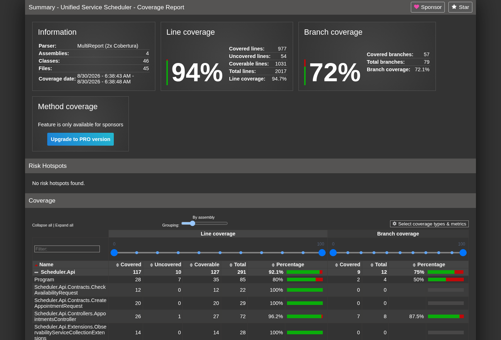
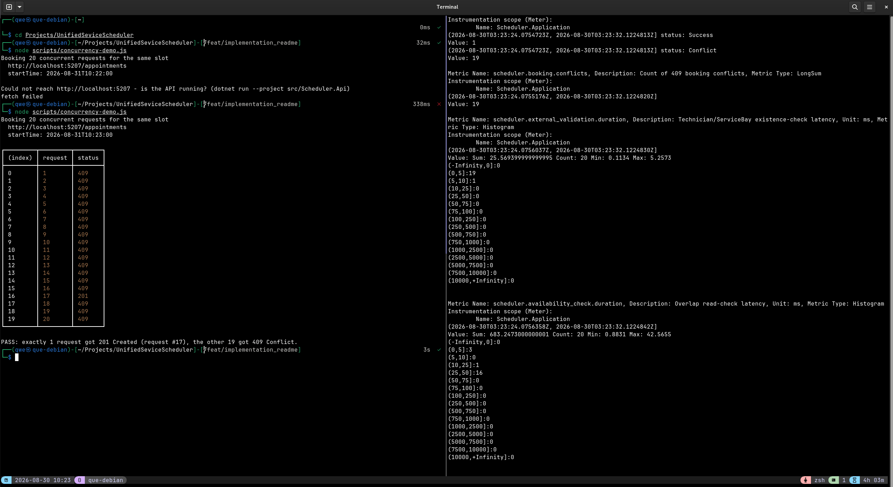
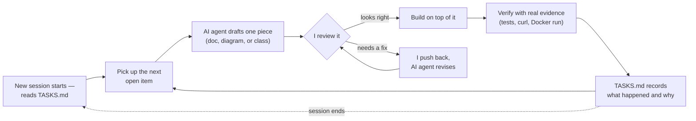

# The Unified Service Scheduler

A dealership vehicle-service appointment scheduler: customers book a service appointment for a vehicle, service type,
dealership, and time. The system validates the requested Technician and Service Bay, checks availability against
existing bookings, and confirms the appointment — safely, even when two people try to book the same slot at the same
time.

## Table of Contents

- [Architecture](#architecture)
- [Getting Started](#getting-started)
  - [Prerequisites](#prerequisites)
  - [Building](#building)
  - [Running the Application](#running-the-application)
  - [Database Migrations](#database-migrations)
  - [Testing](#testing)
    - [Unit Tests](#unit-tests)
    - [Integration Tests](#integration-tests)
    - [Manual API testing](#manual-api-testing)
      - [Postman collection](#postman-collection)
      - [Concurrency demo script](#concurrency-demo-script)
- [Deployment](#deployment)
  - [A note on the database](#a-note-on-the-database)
  - [Secrets and connection strings](#secrets-and-connection-strings)
  - [As build artifacts](#as-build-artifacts)
  - [As a Docker container](#as-a-docker-container)
- [CI/CD](#cicd)
  - [GitHub Actions](#github-actions)
  - [Dependabot](#dependabot)
- [AI Collaboration Narrative](#ai-collaboration-narrative)
  - [How I use my AI](#how-i-use-my-ai)
    - [Starting with a clear brief](#starting-with-a-clear-brief)
    - [Using Architecture to Validate the Solution](#using-architecture-to-validate-the-solution)
    - [The AI was useful, but I didn't treat it as the authority](#the-ai-was-useful-but-i-didnt-treat-it-as-the-authority)
  - [Verification was part of the development process](#verification-was-part-of-the-development-process)
  - [What the AI contributed](#what-the-ai-contributed)

## Architecture

See [architecture.md](./architecture.md) for the full System Design Document — C4 diagrams, data model, data flow,
security, observability, technology choices, testing strategy, and future evolution. [TASKS.md](./TASKS.md) tracks
implementation progress task by task, if you want to see how the project actually got built.

## Getting Started

### Prerequisites

| Tool                                                                                          | Required?                                                 | Needed for                                                                                                 |
| --------------------------------------------------------------------------------------------- | --------------------------------------------------------- | ---------------------------------------------------------------------------------------------------------- |
| [.NET 10 SDK](https://dotnet.microsoft.com/download/dotnet/10.0)                              | **Required**                                              | Building, running, and testing the app                                                                     |
| `dotnet-ef` global tool (`dotnet tool install --global dotnet-ef`)                            | Optional — required to add a migration                    | [Database Migrations](#database-migrations) (`dotnet ef migrations add ...`); not needed to build/run/test |
| [Node.js 18+](https://nodejs.org/) (built-in `fetch`/`crypto.randomUUID()`, no `npm install`) | Optional — required for the concurrency demo script       | [Concurrency demo script](#concurrency-demo-script) (`node scripts/concurrency-demo.js`)                   |
| [Postman](https://www.postman.com/downloads/)                                                 | Optional — required to run the Postman collection         | [Postman collection](#postman-collection)                                                                  |
| Docker                                                                                        | Optional — required for the containerized deployment path | [As a Docker container](#as-a-docker-container)                                                            |
| [Azure CLI](https://learn.microsoft.com/cli/azure/) (`az`)                                    | Optional — required for the Azure App Service deploy path | `az webapp up ...` in [Deployment](#deployment)                                                            |

`dotnet tool restore` (uses the .NET SDK above, no separate install) also pulls in
`dotnet-reportgenerator-globaltool`, pinned in `.config/dotnet-tools.json` — only needed if you want to turn coverage
output into a browsable HTML report locally; see
[Testing](#testing).

You don't need to install a database server. This assessment uses SQLite — just a local file, created automatically the
first time you run the app. See
[A note on the database](#a-note-on-the-database) before deploying anywhere real.

### Building

```bash
dotnet restore UnifiedSeviceScheduler.sln
dotnet build UnifiedSeviceScheduler.sln --configuration Release
```

### Running the Application

```bash
dotnet run --project src/Scheduler.Api
```

By default this listens on `http://localhost:5207` and `https://localhost:7048` (see
`src/Scheduler.Api/Properties/launchSettings.json`). The first time it runs, it applies EF Core migrations
automatically — creating `scheduler.db` next to the running executable, holding just `Appointment`/`AppointmentSlot`
(see architecture.md §6 Data Model). Dealership is no longer a table this app seeds; it's this platform's own internal
service, and `MockDealershipProvider` (`Scheduler.Infrastructure/ExternalServices/`) returns a known dealership so
there's something to book against without a real Dealership Service deployed yet:

| Field           | Value                                  |
| --------------- | -------------------------------------- |
| Id              | `11111111-1111-1111-1111-111111111111` |
| Name            | Downtown Dealership                    |
| Operating hours | Mon–Sat, 08:00–17:00 (closed Sunday)   |

**Endpoints:**

| Endpoint                         | Purpose                                                                          |
| -------------------------------- | -------------------------------------------------------------------------------- |
| `POST /appointments`             | Book an appointment (guest checkout — see Domain Assumptions in architecture.md) |
| `GET /appointments/availability` | Check whether a Technician/Service Bay/time slot is free, without booking        |
| `GET /health`                    | Liveness check                                                                   |
| `GET /scalar/v1`                 | Interactive API documentation (Development only)                                 |
| `GET /openapi/v1.json`           | Raw OpenAPI document (Development only)                                          |

**Response contract**: every response from the two business endpoints above — success or failure — is wrapped in one
standard envelope: `data` (the real payload, `null` on failure),
`statusCode`, `message`, and `errors` (an array of `{ errorCode, errorMessage }`, populated with one entry per failure —
more than one if a request fails validation on several fields at once). `/health` is deliberately left in its plain-text
form, not wrapped, since it's a standard health-check convention consumed by infrastructure, not the same clients
parsing the booking API's JSON. See architecture.md §14 for the full write-up, including why the wrapping logic lives in
exactly one place (`ApiResponseWrapperFilter` + `ApiExceptionHandler`, both calling `ApiResponseFactory`) rather than
being duplicated per controller action.

A Postman collection (`src/Scheduler.Api/Scheduler.Api.postman_collection.json`) has ready-to-run requests covering the
happy path, every documented failure branch (400/409), and a hands-on double-booking demo; a standalone Node.js script
(`scripts/concurrency-demo.js`) reproduces the concurrency guarantee specifically —
see [Manual API testing](#manual-api-testing) under Testing. Treat these as a manual/exploratory reference, not the
automated test suite.

**Service types you can book** (see `src/Scheduler.Infrastructure/Data/servicetypes.json`):

| Code                  | Description               | Duration |
| --------------------- | ------------------------- | -------- |
| `OIL_CHANGE`          | Oil Change                | 30 min   |
| `TIRE_CHANGE`         | Tire Change / Replacement | 60 min   |
| `BRAKE_INSPECTION`    | Brake Inspection          | 45 min   |
| `INTERIOR_CLEANING`   | Interior Cleaning         | 90 min   |
| `BATTERY_REPLACEMENT` | Battery Replacement       | 30 min   |
| `WHEEL_ALIGNMENT`     | Wheel Alignment           | 60 min   |

`technicianId`/`serviceBayId` are validated against this platform's own internal services (Dealership/Technician/
Service Bay — see architecture.md's internal-vs-external distinction), mocked by default for this assessment, so any
non-empty GUID is accepted. The matching `InfrastructureClients:*:Http:BaseUrl` settings (see Configuration below) wire
up the DI shape for a real implementation instead — not yet functional, see that row's caveat.

**Configuration:**

| Setting                                                                                        | Location                                               | Purpose                                                                                                                                                                                                                                                       |
| ----------------------------------------------------------------------------------------------- | ------------------------------------------------------ | -------------------------------------------------------------------------------------------------------------------------------------------------------------------------------------------------------------------------------------------------------------- |
| `ConnectionStrings:SchedulerDb`                                                                  | `appsettings.json`                                     | SQLite by default — see [A note on the database](#a-note-on-the-database)                                                                                                                                                                                     |
| `InfrastructureClients:{DealershipService,ServiceBayService,TechnicianService}:Http:BaseUrl`     | `appsettings.json`                                     | Empty by default, so each internal service runs on its `Mock*Provider`. Setting any one of these wires up the DI registration (`AddTransient` + `AddRefitClient`) for that service's real provider instead — a config change only, no code/DI change needed. **Not yet functional**: `DealershipProvider`/`TechnicianProvider`/`ServiceBayProvider` are wiring stubs that `throw NotImplementedException` today — only the swap-later DI shape is built, not the real HTTP call logic. See `AddInternalServiceProviders` in `Scheduler.Infrastructure/ServiceCollectionExtensions.cs` and architecture.md's Domain Assumptions |
| `Serilog:*`                                                                                      | `serilog.json`                                         | Logging sinks, output template, level overrides — kept out of `Program.cs` deliberately                                                                                                                                                                       |
| `OpenTelemetry` OTLP endpoint                                                                    | `serilog.json` (`WriteTo:OpenTelemetry:Args:endpoint`) | Traces/metrics/logs export target; defaults to `http://localhost:4317` and fails quietly if nothing's listening — see architecture.md §10                                                                                                                    |

### Database Migrations

EF Core migrations live under `src/Scheduler.Infrastructure/DataAccess/Migrations/`, not the default project-root
`Migrations/` folder. When you add a new migration, pass `--output-dir`
explicitly so it lands in the same place as the existing ones:

```bash
dotnet ef migrations add <MigrationName> \
  --project src/Scheduler.Infrastructure/Scheduler.Infrastructure.csproj \
  --startup-project src/Scheduler.Api/Scheduler.Api.csproj \
  --output-dir DataAccess/Migrations
```

Leave off `--output-dir` and you'll get a brand new top-level `Migrations/` folder sitting next to the correct one —
`dotnet ef` doesn't infer the location from existing migrations.

The schema holds only `Appointment`/`AppointmentSlot` today — an earlier revision also had `Dealerships` and
`Customers` tables; the `DropDealershipAndEmbedCustomer` migration removed both once Dealership became this
platform's own internal service and Customer became a Value Object owned directly by `Appointment` (see
architecture.md §3 Domain Assumptions and §6 Data Model).

### Testing

```bash
dotnet test UnifiedSeviceScheduler.sln
```

80 tests: 66 unit tests (`tests/Scheduler.UnitTests`) covering Domain, Application, and Infrastructure in isolation with
Moq, and 14 integration tests (`tests/Scheduler.IntegrationTests`) exercising the real HTTP pipeline against an isolated
temp SQLite database per test class, via `WebApplicationFactory`. If you're reviewing this project and want the fastest
path to confidence in it, read the subsections below in order:
Unit Tests → Integration Tests → [Manual API testing](#manual-api-testing).

#### Unit Tests

```bash
dotnet test tests/Scheduler.UnitTests
```

| Test class                                                                                 | Tests | Covers                                                                                                                     |
| ------------------------------------------------------------------------------------------- | ----- | --------------------------------------------------------------------------------------------------------------------------- |
| `CreateAppointmentCommandValidatorTests`                                                     | 10    | FluentValidation rules for the booking request (every required-field/empty/past-time branch)                               |
| `TimeRangeTests`                                                                             | 8     | Domain value object: construction validation, `Overlaps` incl. adjacency edge cases, equality                               |
| `AppointmentTests`                                                                           | 8     | Aggregate `Create` validation, embedded `Customer` Value Object, slot-count generation for 30/45/60-min durations           |
| `DealershipTests`                                                                            | 7     | `Dealership.IsWithinOperatingHours` boundaries (exactly-at-open/close, before/after), Sunday closure, cross-midnight — moved off `AppointmentSchedulingPolicy` onto `Dealership` itself |
| `CreateAppointmentCommandHandlerTests`                                                       | 7     | Every handler failure branch, insert-conflict → 409, notification/cache calls verified via `Moq.Verify`                    |
| `AppointmentAvailabilityCheckerTests`                                                        | 7     | Every `AvailabilityStatus` branch (available, unavailable, invalid resource, outside hours, unknown service type)          |
| `CheckAvailabilityQueryValidatorTests`                                                       | 5     | FluentValidation rules for the availability query                                                                          |
| `JsonServiceTypeProviderTests`                                                               | 3     | JSON-backed service type catalog (known/unknown code, get-all)                                                             |
| `AppointmentSchedulingPolicyTests`                                                           | 3     | Domain policy: the no-overlap invariant only — operating-hours moved to `DealershipTests` above                            |
| `MockTechnicianProviderTests` / `MockServiceBayProviderTests` / `MockDealershipProviderTests` | 6     | Mocked internal-service existence/lookup checks (Technician/Service Bay existence; Dealership known-id vs. unknown-id)      |
| `CheckAvailabilityQueryHandlerTests`                                                         | 2     | Query handler happy path + unknown-service-type failure                                                                    |

**Coverage**: collection is wired up via `coverlet.collector` (`--collect:"XPlat Code
Coverage"`) and runs on every CI build (see [GitHub Actions](#github-actions)). To turn the raw Cobertura XML into a
browsable HTML report locally, this repo pins
[`dotnet-reportgenerator-globaltool`](https://github.com/danielpalme/ReportGenerator) as a local tool
(`.config/dotnet-tools.json`):

```bash
dotnet tool restore
dotnet test UnifiedSeviceScheduler.sln --collect:"XPlat Code Coverage" --results-directory ./TestResults
dotnet tool run reportgenerator \
  -reports:"TestResults/**/coverage.cobertura.xml" \
  -targetdir:"TestResults/CoverageReport" \
  -reporttypes:Html \
  -classfilters:"-Microsoft.AspNetCore.OpenApi.Generated" \
  -title:"Unified Service Scheduler - Coverage Report"
```

(The `classfilters` flag excludes ASP.NET Core's own OpenAPI source-generated code, which would otherwise dilute the
numbers with generated code nobody on this project wrote.) Open
`TestResults/CoverageReport/index.html` in a browser. CI generates and uploads this same report as a build artifact —
see [GitHub Actions](#github-actions) — so a reviewer never has to run this locally just to see coverage.

Latest local run — 94.7% line / 72.1% branch coverage across Domain, Application, and Infrastructure (Api's
OpenAPI-generated code excluded, as above):



#### Integration Tests

```bash
dotnet test tests/Scheduler.IntegrationTests
```

`AppointmentBookingTests` (`tests/Scheduler.IntegrationTests`), via
`SchedulerApiFactory : WebApplicationFactory<Program>`, one isolated temp SQLite file per test class instance:

| Test                                                                   | Proves                                                                                                                                                                                                      |
| ---------------------------------------------------------------------- | ----------------------------------------------------------------------------------------------------------------------------------------------------------------------------------------------------------- |
| `CreateAppointment_ConcurrentRequestsForSameSlot_ExactlyOneSucceeds`   | **The core requirement** — 8 genuinely parallel requests for the same slot, exactly one `201` + seven `409`s. See [Demonstrating the concurrency guarantee](#demonstrating-the-concurrency-guarantee) below |
| `CreateAppointment_ValidRequest_Returns201WithSlots`                   | Happy path — `201` plus the generated `AppointmentSlot` rows                                                                                                                                                |
| `CreateAppointment_SameSlotTwice_SecondReturns409`                     | Double-booking rejected even without a race — first booking wins, an immediate second attempt at the identical slot is rejected                                                                             |
| `CreateAppointment_OutsideOperatingHours_Returns400`                   | Time before dealership opening rejected                                                                                                                                                                     |
| `CreateAppointment_Sunday_Returns400`                                  | Dealership closed Sunday rejected                                                                                                                                                                           |
| `CreateAppointment_InvalidTechnician_Returns400`                       | Unknown/invalid technician rejected                                                                                                                                                                         |
| `CreateAppointment_EmptyVehicleField_Returns400`                       | Required-field validation enforced end-to-end, not just at the unit level                                                                                                                                   |
| `CreateAppointment_MultipleValidationFailures_ReturnsOneErrorPerField` | The `ApiResponse` envelope's `errors` array carries every failure at once — a request invalid on two independent fields comes back with two entries, not just the first one found                           |
| `CreateAppointment_SameCustomerTwice_BothSucceedWithIndependentEmbeddedCustomer` | `Customer` is a Value Object owned by `Appointment`, not a shared entity — two bookings from the same person succeed as two independent rows carrying matching embedded Name/Email/Phone, not a lookup-and-reuse of one record |
| `CheckAvailability_BookedSlot_ReturnsUnavailable`                      | Availability query reflects a real booking                                                                                                                                                                  |
| `CheckAvailability_FreeSlot_ReturnsAvailable`                          | Availability query on an open slot                                                                                                                                                                          |
| `HealthCheck_ReturnsHealthy`                                           | `/health` liveness                                                                                                                                                                                          |
| `Request_WithCorrelationIdHeader_EchoesItBack`                         | Inbound `X-Correlation-Id` is honored verbatim                                                                                                                                                              |
| `Request_WithoutCorrelationIdHeader_AutoGeneratesOne`                  | A fresh correlation id is minted when the header is absent                                                                                                                                                  |

**Two ways to exercise these**: automated, via `dotnet test` above (this is what CI runs on every PR); or manually,
against a real running instance of the API, using the Postman collection — see [Manual API testing](#manual-api-testing)
directly below. It maps onto the same scenarios as the table above (happy path, 409 conflict, 400s, availability checks,
correlation-id capture) so it's a reasonable way to sanity-check the API by hand without reading test code first.

##### Demonstrating the concurrency guarantee

`CreateAppointment_ConcurrentRequestsForSameSlot_ExactlyOneSucceeds` is the test that matters most for this project —
it's the actual proof of the core requirement (concurrency safety), not just a claim about it. It fires 8 genuinely
parallel booking requests at the same Technician/Service Bay/time and asserts that exactly one comes back `201 Created`
and the other seven come back `409 Conflict`. Run it on its own:

```bash
dotnet test UnifiedSeviceScheduler.sln \
  --filter "FullyQualifiedName~CreateAppointment_ConcurrentRequestsForSameSlot_ExactlyOneSucceeds" \
  --logger "console;verbosity=normal"
```

The `console;verbosity=normal` logger prints a single `Passed` line for the test, which is enough to confirm the
eight-way race resolved to exactly one winner. To see it fail-safe rather than just pass, open
`tests/Scheduler.IntegrationTests/AppointmentBookingTests.cs`, find that test, and read it alongside architecture.md §12
(Testing Strategy) and the Data Model / Data Flow sections — they explain why it's the
`UNIQUE(ResourceKind, ResourceId, SlotStart)`
constraint on `AppointmentSlot` doing the actual work here (see architecture.md's
[Concurrency Strategy](./architecture.md#concurrency-strategy) section), not the pre-insert overlap check, which is a
fast-fail UX optimization only. **Never take a green result here as "no bugs" and stop reading** — if you want to see
the guarantee actually get exercised instead of just trusting the assertion, drop a breakpoint (or a
`Console.WriteLine`)
inside `CreateAppointmentCommandHandler`'s insert path and watch seven of the eight parallel calls hit the
unique-constraint violation and get mapped to `409` while one succeeds.

Prefer to see it happen against a real running instance instead of inside the test suite? See
[Concurrency demo script](#concurrency-demo-script) below — a small Node.js script that fires 20 genuinely concurrent
requests at the same slot over real HTTP and reports the same 1×`201`

- N×`409` split.

#### Manual API testing

Two purpose-built tools, for two different jobs — both need the API running first:

```bash
dotnet run --project src/Scheduler.Api
```

(the default "http" launch profile, `http://localhost:5207` — both tools below point at it by default, no
`--launch-profile` flag needed.)

- **[Postman collection](#postman-collection)** — general exploratory testing: happy path, validation errors, sequential
  double-booking. Works for anyone, no IDE required.
- **[Concurrency demo script](#concurrency-demo-script)** — the project's actual core requirement, specifically. A small
  Node.js script, not Postman, because proving requests genuinely race for the same slot needs real parallel dispatch
  (`Promise.all`), which a point-and-click tool can't give you.

##### Postman collection

`src/Scheduler.Api/Scheduler.Api.postman_collection.json` — import it into Postman (File → Import, or drag the file onto
the app) and you get two folders:

| Folder                      | What it demonstrates                                                                                                                                                                                                                                                                                                                                                                                                               |
| --------------------------- | ---------------------------------------------------------------------------------------------------------------------------------------------------------------------------------------------------------------------------------------------------------------------------------------------------------------------------------------------------------------------------------------------------------------------------------- |
| Happy Path & Validation     | The same 7 scenarios as the "happy path" rows in the Integration Tests table above — health check, create/re-check availability, repeat-customer dedupe, the two 400 branches. Each request has `pm.test(...)` assertions checking both the HTTP status and the `ApiResponse` envelope fields (`statusCode`, `data`, `errors[].errorCode`), so a full Collection Runner pass gives you a pass/fail summary, not just raw responses |
| Double Booking (Sequential) | Book a slot, then immediately rebook the identical one — `201` then `409` (with `errors[0].errorCode` = `Conflict`). Proves the guarantee holds when one request finishes before the next starts — the easy case, not the project's real concurrency requirement (that's the script below)                                                                                                                                         |

**Booking times are computed, not hardcoded** — a literal date would eventually land in the past, and re-running the
collection against your own persisted `scheduler.db` would otherwise just re-book a slot you already booked. This
collection uses a **collection-level pre-request script** (Postman → select the collection → Pre-request Script tab)
that runs before every request, computing tomorrow's date (rolling past Sunday, since the dealership is closed) and
clamping the current time-of-day into the 08:00–16:00 operating window, then storing the results as collection variables
(`pm.collectionVariables.set(...)`) that every request references as `{{bookingStartTime}}` and friends. It recomputes
on every request rather than once — deliberately: since the whole run finishes in well under a minute and the
computation is stable within a minute, every request in one run agrees on the same times without needing
"compute once" bookkeeping.

Before running, check the `baseUrl` collection variable (Postman → select the collection → Variables tab) matches your
launch profile — defaults to `http://localhost:5207`.

##### Concurrency demo script



`scripts/concurrency-demo.js` — this is the project's core requirement, reproduced by hand against a real running
instance instead of inside the test suite. It fires 20 genuinely concurrent booking requests (real parallel HTTP
dispatch via `Promise.all`, not a human clicking through Postman tabs) at the identical Technician/Service Bay/time and
reports the status-code breakdown:

```bash
node scripts/concurrency-demo.js
```

Expected output: exactly one `201 Created`, the other nineteen `409 Conflict` — the script checks this itself and prints
`PASS`/`FAIL`, exiting non-zero on a mismatch. Pure Node, no
`npm install`, no dependencies — `fetch` and `crypto.randomUUID()` are both built in as of Node 18+. A fresh random
Technician/Service Bay pair is generated each run, so re-running it immediately never collides with a slot booked by a
previous run.

Read this alongside [Demonstrating the concurrency guarantee](#demonstrating-the-concurrency-guarantee)
above — this script is a convenient way to _see_ the guarantee, not the project's real proof of it. That's still
`CreateAppointment_ConcurrentRequestsForSameSlot_ExactlyOneSucceeds`, verified deterministically in CI on every PR. If
the two ever disagree, trust the xUnit test.

## Deployment

### A note on the database

SQLite is used here strictly because it's convenient for this assessment — no database server to stand up, the file just
appears the first time you run the app. **It is not meant for a real deployment.** For anything beyond local dev, use
**Azure SQL Database**:

1. Update `ConnectionStrings:SchedulerDb` to your Azure SQL connection string (via app config/environment variable —
   never commit it).
2. In `src/Scheduler.Infrastructure/ServiceCollectionExtensions.cs`, swap the provider call from
   `options.UseSqlite(connectionString)` to `options.UseSqlServer(connectionString)`
   (the line's already there, commented out, right next to it).

That's the whole migration — same EF Core model, same migrations, same `AppointmentSlot`
concurrency design (it's a plain `UNIQUE` constraint, not a SQLite-specific trick). See architecture.md's Data Model
section for why that portability was a deliberate design choice.

### Secrets and connection strings

Don't put the production connection string in a GitHub Actions secret, or type it into App Service's Configuration blade
by hand — use **Azure Key Vault** instead, so the actual value never has to exist inside the CI/CD pipeline at all:

- **Azure App Service**: grant the app's Managed Identity a `Key Vault Secrets User` role on the vault, then set
  `ConnectionStrings__SchedulerDb` to
  a [Key Vault reference](https://learn.microsoft.com/azure/app-service/app-service-key-vault-references)
  (`@Microsoft.KeyVault(SecretUri=...)`). That reference is just a pointer, not a secret — safe to check into
  Infrastructure-as-Code. Azure resolves the real value at runtime using the Managed Identity; the deployment pipeline
  never touches it.
- **VM / container**: pull secrets into `IConfiguration` at startup with
  `Azure.Extensions.AspNetCore.Configuration.Secrets` + `DefaultAzureCredential`, using a Managed Identity (or a
  federated GitHub OIDC identity, if the workload runs outside Azure) — same idea, no stored secret value flowing
  through CI/CD.
- If GitHub Actions needs secrets at all, they should be **deployment** credentials (e.g. an OIDC identity for
  `az login`), never the application's own connection string. If a DB connection string ever ends up in a GitHub Actions
  secret, that's the exact thing this setup is meant to avoid.

See architecture.md §9 (Security) for the full write-up. This is documented as a recommendation per `.agent/agent.md`'s
scope, not implemented here — there's no real Azure environment to point it at in this assessment.

### As build artifacts

**To a VM** (Linux, systemd example):

```bash
dotnet publish src/Scheduler.Api --configuration Release --output /opt/scheduler-api
```

Run it under a process manager rather than a bare `dotnet` process. Example systemd unit
(`/etc/systemd/system/scheduler-api.service`):

```ini
[Unit]
Description=Unified Service Scheduler API
After=network.target

[Service]
WorkingDirectory=/opt/scheduler-api
ExecStart=/usr/bin/dotnet /opt/scheduler-api/Scheduler.Api.dll
Restart=always
RestartSec=10
User=www-data
Environment=ASPNETCORE_ENVIRONMENT=Production
Environment=ASPNETCORE_URLS=http://+:8080

[Install]
WantedBy=multi-user.target
```

The connection string is deliberately left out of this unit file — see
[Secrets and connection strings](#secrets-and-connection-strings) for why, and how the app should pull it from Azure Key
Vault at startup instead.

Put a reverse proxy (nginx/Caddy) in front for TLS termination — architecture.md §9 (Security) already assumes this for
the production HTTPS story.

**To Azure App Service:**

```bash
az webapp up \
  --name <app-name> \
  --resource-group <resource-group> \
  --runtime "DOTNETCORE:10.0" \
  --sku B1
```

Set any `serilog.json`-related settings through App Service's own configuration (Application Settings) — not by
committing them. For `ConnectionStrings__SchedulerDb`, use a Key Vault reference there instead of the raw value; see
[Secrets and connection strings](#secrets-and-connection-strings).

### As a Docker container

A multi-stage `Dockerfile` and `docker-compose.yml` live at the repo root.

```bash
docker build -t scheduler-api .
docker run -p 8080:8080 -v scheduler-data:/app/data scheduler-api
```

or, with Compose:

```bash
docker compose up --build
```

The container runs as a non-root user, listens on `:8080`, and stores the SQLite file under
`/app/data` — mount a volume there, as shown, so it survives container restarts. Same rule as above: for anything beyond
a quick demo, override `ConnectionStrings__SchedulerDb` with an Azure SQL connection string via environment variable (no
image rebuild needed) rather than relying on the SQLite file long-term.

**Future: Kubernetes.** Not implemented here, but the container is already stateless aside from the SQLite file. The
natural path is: move to Azure SQL Database (removing the local-file dependency entirely), then a standard
`Deployment` + `Service` +
`HorizontalPodAutoscaler` applies with no further changes to the image. This lines up with architecture.md §13's
Scalability Strategy — the API layer is stateless once the availability cache also moves off in-process `IMemoryCache`
to Redis.

## CI/CD

### GitHub Actions

`.github/workflows/ci.yml` builds and runs the full test suite on every pull request against
`main` (when it's opened, and on every push to the PR branch after that) and on every push to
`main` itself. Test results, including raw coverage data, are uploaded as the `test-results`
workflow artifact; a browsable HTML coverage report (generated the same way described in
[Coverage report](#testing) above) is uploaded separately as `coverage-report-html` — download it from the workflow
run's Summary page and open `index.html`, no local tooling required.

### Dependabot

`.github/dependabot.yml` checks weekly for updates across three ecosystems: NuGet packages, the GitHub Actions versions
used in the workflow, and the Dockerfile's base images. Each opens its own PR when there's an update available, and the
CI workflow above validates it like any other change.

## AI Collaboration Narrative

I used Claude (Anthropic) as a development partner throughout this assessment. The project was built over several
working sessions rather than in one conversation. I treated each session as part of the same development process, with
TASKS.md keeping track of what had been completed, what was still open, and the decisions we had made.

My workflow was fairly simple:



This was important because I didn't want the AI agent to generate the whole project and then have me review hundreds of lines of
code at the end. I preferred to work through it in smaller pieces: design something, review it, implement it, test it,
and then move to the next piece.

### How I use my AI

#### Starting with a clear brief

Before writing code, I created Agent.md to define how I wanted the AI agent to work with me. It later moved to
`.agent/agent.md`, alongside a `.agent/skills/` folder for topic-specific references I didn't want cluttering the main
brief — one directory per skill, each holding a `SKILL.md`:

- `ddd-cleanarchitecture-solid/SKILL.md` — Domain-Driven Design / Clean Architecture / SOLID guidance, used to ground a
  later refactor's Repository-vs-Provider naming split and the decision to make Customer a Value Object instead of an
  entity.
- `multi-agent-collaboration/SKILL.md` — written after a real incident with running agents in parallel (more on that
  below).
- `clean-code/SKILL.md` — naming and function-clarity guidelines.

One brief plus focused skills reads better than one file growing indefinitely.

I gave the agent the role of a Senior Solution Architect / Software Engineer and described the domain assumptions,
engineering priorities, and constraints of the assessment. I also ranked the priorities so there was less room for
ambiguity when making trade-offs:

1. Correctness
2. Domain clarity
3. Concurrency safety
4. Maintainability
5. Testability
6. Observability
7. Scalability
8. Performance
9. Reliability
10. Simplicity

I also used TASKS.md as a running record of the work. At the start of a new session, I could simply continue from the
next open item instead of reconstructing the project history from previous conversations.

#### Using Architecture to Validate the Solution

I used the C4 diagrams and data-flow diagrams to validate the architecture before moving into implementation.

I started by defining the system boundary, the main actors, and the responsibilities of the Scheduler. From there, I
worked through the major components and how they interact. This helped ensure that each responsibility had a clear place
in the architecture and that the design was not becoming unnecessarily coupled.

The data-flow and sequence diagrams were then used to reason through the main booking scenarios, including successful
bookings, unavailable resources, invalid requests, and concurrent booking attempts. Thinking through these scenarios
before implementation helped identify important concerns such as resource availability, consistency, and failure
handling early in the design process.

I also used the diagrams as a reference throughout development. When an implementation decision changed, I reviewed
whether the architecture and documentation still represented the actual system and updated them when necessary.

#### The AI was useful, but I didn't treat it as the authority

I did not treat the AI's suggestions as final decisions. I used them as a starting point and reviewed them against
the requirements, architecture, and expected production behavior.

1. Concurrency: I challenged the booking implementation around concurrent requests rather than assuming that a normal
   availability check was sufficient. I verified the behavior with concurrent requests against the same time slot and
   confirmed that the system maintained the expected booking constraint.
2. Architecture trade-offs: When there were multiple reasonable approaches, I asked the agent to explain the trade-offs rather
   than simply choosing the first suggestion. This included decisions around the database, API structure, concurrency
   control, caching, and how much complexity was appropriate for the assessment.
3. Requirements and assumptions: Where the assessment requirements were ambiguous, I used the agent to explore possible
   interpretations, then selected and documented the assumptions that best represented a realistic dealership scenario.
   This included operating hours, Technician and Service Bay availability, service duration, and future resource
   constraints.
4. Design consistency: I used the agent to review whether the implementation remained consistent with the architecture and
   domain decisions. When an implementation started to diverge from the agreed design, I corrected it rather than
   allowing the code to define the architecture implicitly.
5. Production considerations: I also challenged recommendations that could introduce unnecessary complexity. For
   example, instead of assuming that distributed caching or additional infrastructure was required from the beginning, I
   designed an evolution path where production metrics would determine when additional scaling mechanisms such as Redis
   would become justified.

### Verification was part of the development process

I used the AI agent to speed up implementation, but I relied on actual evidence to decide whether something worked.

The main checks were:

- Build succeeds.
- Unit tests pass.
- Integration tests pass.
- Concurrency behavior is verified with real HTTP requests.
- Docker image builds successfully.
- The application runs inside Docker.
- API endpoints are tested against the running application.
- Persistent data survives container restart.
- Documentation reflects the current implementation.

The test suite currently contains 80 tests: 66 unit tests and 14 integration tests. The CI pipeline also runs the build and
tests automatically on pull requests so that the same checks are repeated after the assessment work is committed.

I also kept the documentation under the same review process as the code. When an implementation decision changed, I
updated architecture.md, TASKS.md, and the README rather than leaving earlier assumptions behind.

**A concrete example of why verification mattered, not just a principle**: for one larger refactor I had Claude run two
subagents in parallel, each in its own isolated git worktree, to save time. Both subagents reported green builds and
passing tests — but before merging anything, checking each worktree's actual branch ancestry showed both had silently
started from an old branch, six commits behind, missing an entire already-shipped feature. One subagent's work was
unaffected by the gap; the other had quietly written test assertions that worked around the missing feature instead of
failing on it — code that was internally consistent but wrong relative to the real target. The lesson (now written up
in `.agent/skills/multi-agent-collaboration/SKILL.md` so it doesn't get re-learned the hard way next time): a subagent
reporting "build and tests pass" only proves it's consistent with whatever it actually started from, not that the
starting point was correct. Caught before it caused damage, by checking the input, not by a test that happened to
fail.

### What the AI contributed

The AI was particularly useful for:

- Exploring architectural alternatives.
- Challenging my initial assumptions.
- Turning ideas into diagrams and documentation.
- Generating implementation starting points.
- Identifying edge cases I might otherwise have missed.
- Writing repetitive code and tests.
- Reviewing existing code.
- Helping investigate errors.
- Keeping documentation aligned with implementation.

But the final decisions were mine.

I treated Claude more like another engineer I could discuss a design with: useful for proposing ideas, asking questions,
and pointing out things I might have missed, but not someone whose answer I automatically accept.
