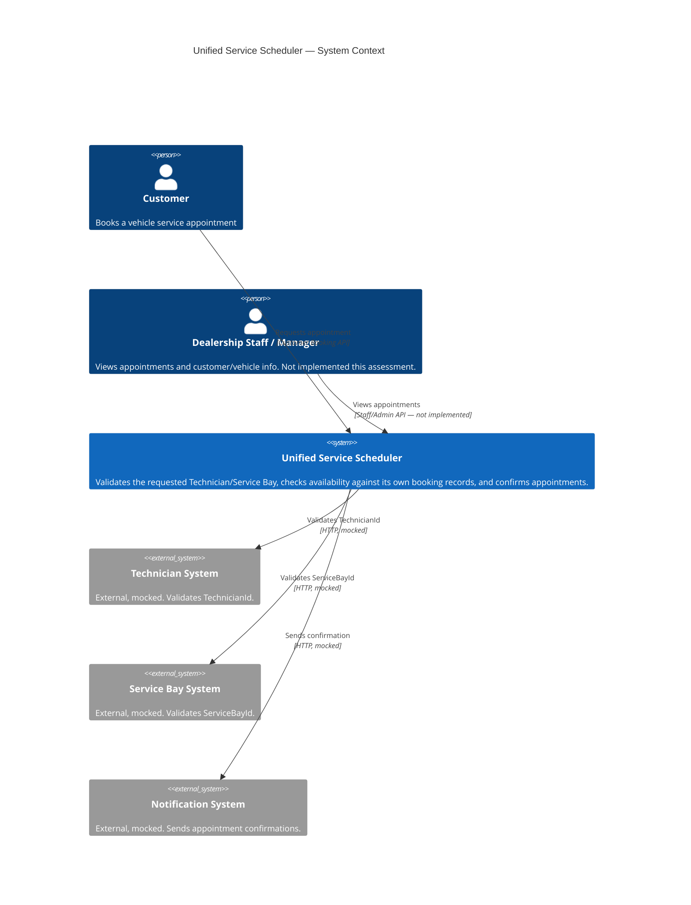
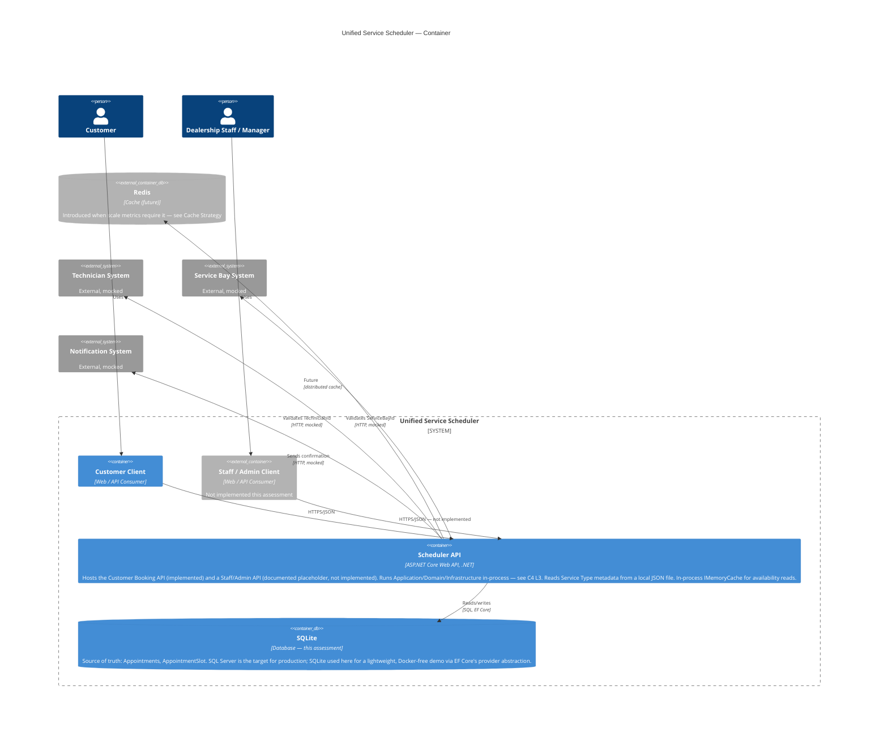
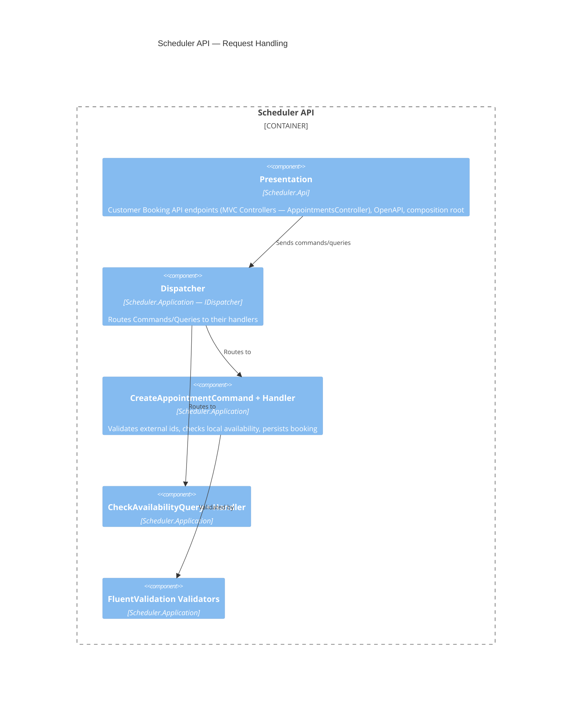
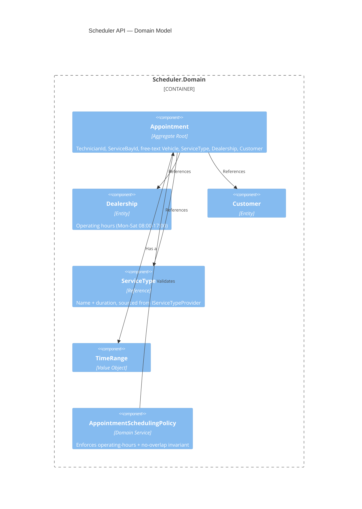
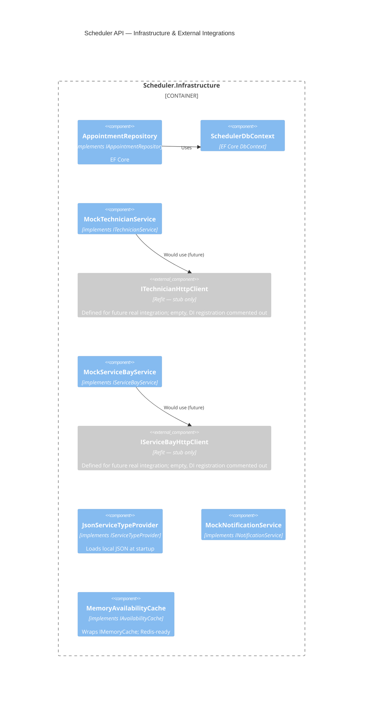
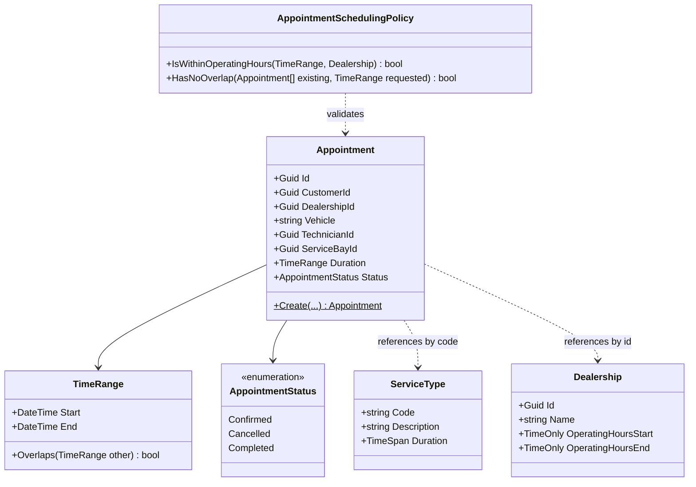
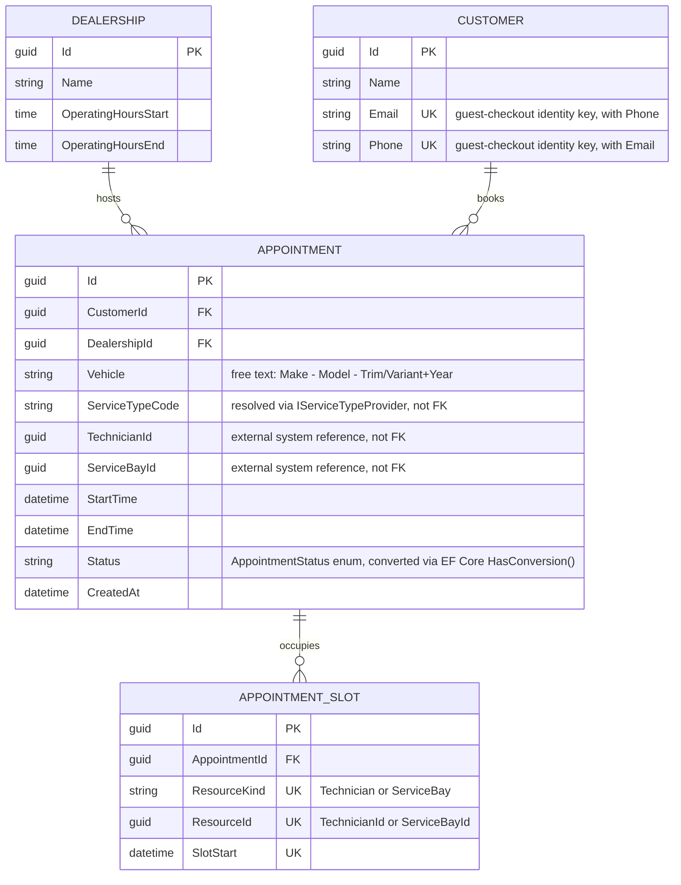
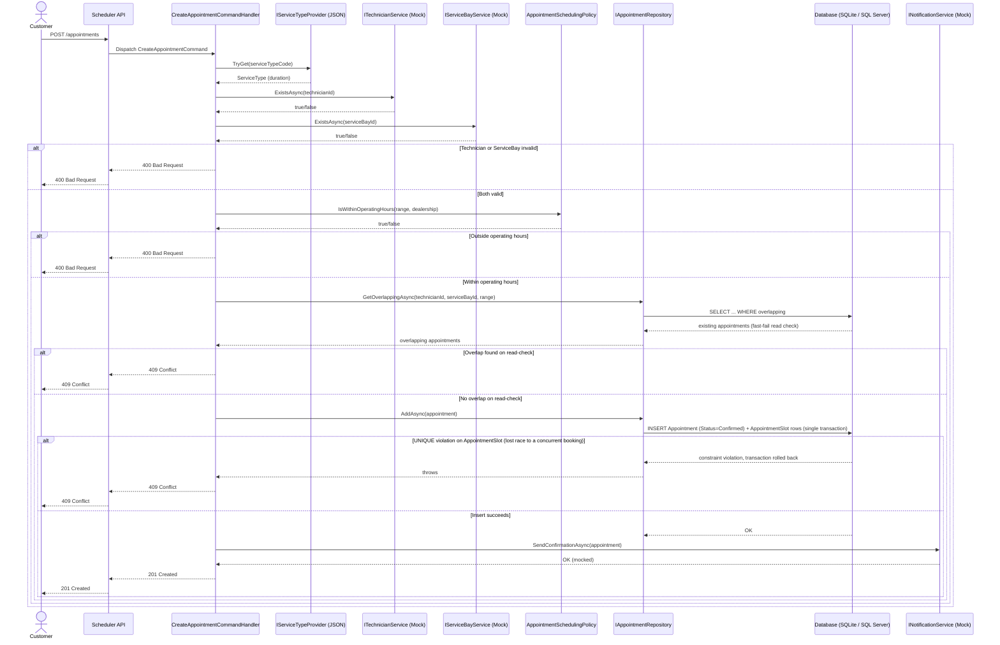

# The Unified Service Scheduler — Architectural Plan

## Table of Contents

- [Original Core requirements](#original-core-requirements)
- [Assessment Scope Notes](#assessment-scope-notes)
    - [External systems are mocked](#external-systems-are-mocked)
    - [Service Type is a static file, not a service](#service-type-is-a-static-file-not-a-service)
    - [Staff/Admin API is documented, not implemented](#staffadmin-api-is-documented-not-implemented)
    - [No authentication or authorization implemented](#no-authentication-or-authorization-implemented)
    - [SQLite instead of SQL Server](#sqlite-instead-of-sql-server)
    - [No API gateway or load balancer](#no-api-gateway-or-load-balancer)
    - [No observability backend deployed](#no-observability-backend-deployed)
    - [No real Azure environment](#no-real-azure-environment)
    - [Single-instance deployment](#single-instance-deployment)
- [Domain Clarifications & Assumptions](#domain-clarifications--assumptions)
    - [Dealership](#dealership)
    - [Service Bay](#service-bay)
    - [Technician](#technician)
    - [Service Type](#service-type)
    - [Vehicle](#vehicle)
    - [Customer](#customer)
    - [Appointment](#appointment)
    - [Future Extensibility](#future-extensibility)
- [3. Architecture Principles](#3-architecture-principles)
- [Key Trade-offs](#key-trade-offs)
    - [Correctness vs. performance and cost](#correctness-vs-performance-and-cost)
    - [Security vs. user experience](#security-vs-user-experience)
    - [Availability vs. correctness](#availability-vs-correctness)
    - [Simplicity vs. designed guarantees](#simplicity-vs-designed-guarantees)
- [4. Target Architecture](#4-target-architecture)
    - [C4 Level 1 - System Context](#c4-level-1---system-context)
    - [C4 Level 2 - Container](#c4-level-2---container)
    - [C4 Level 3 - Component](#c4-level-3---component)
        - [L3a — Request Handling (Presentation + Application)](#l3a--request-handling-presentation--application)
        - [L3b — Domain Model](#l3b--domain-model)
        - [L3c — Infrastructure & External Integrations](#l3c--infrastructure--external-integrations)
    - [C4 Level 4 - Code](#c4-level-4---code)
        - [L4a — Handler & MockService Injection](#l4a--handler--mockservice-injection)
        - [L4b — Domain Model Detail](#l4b--domain-model-detail)
- [Data Model](#data-model)
- [Data Flow](#data-flow)
- [5. Cache Strategy](#5-cache-strategy)
    - [What is cached](#what-is-cached)
    - [Initial implementation — in-process `IMemoryCache`](#initial-implementation--in-process-imemorycache)
    - [Future: Redis distributed cache](#future-redis-distributed-cache)
- [6. Security](#6-security)
    - [Current state: Customer Booking API is intentionally unauthenticated](#current-state-customer-booking-api-is-intentionally-unauthenticated)
    - [Abuse mitigation for the unauthenticated booking endpoint](#abuse-mitigation-for-the-unauthenticated-booking-endpoint)
    - [Future: once login is introduced](#future-once-login-is-introduced)
    - [Transport security](#transport-security)
    - [Secrets and connection strings](#secrets-and-connection-strings)
    - [Explicit non-goals](#explicit-non-goals)
- [7. Observability](#7-observability)
    - [Structured logging](#structured-logging)
    - [Domain-specific metrics](#domain-specific-metrics)
    - [Tracing](#tracing)
    - [Correlation IDs](#correlation-ids)
    - [Health checks](#health-checks)
    - [Backend](#backend)
- [8. Technology Choices](#8-technology-choices)
- [9. Testing Strategy](#9-testing-strategy)
    - [Unit tests — target >80% coverage on Domain, Application, Infrastructure](#unit-tests--target-80-coverage-on-domain-application-infrastructure)
    - [Integration tests — edge cases, not a re-run of unit tests](#integration-tests--edge-cases-not-a-re-run-of-unit-tests)
    - [Coverage & CI](#coverage--ci)
- [10. Future Evolution](#10-future-evolution)
    - [Concurrency Strategy](#concurrency-strategy)
    - [Scalability Strategy](#scalability-strategy)
    - [Production Capacity Triggers](#production-capacity-triggers)
    - [Reliability](#reliability)

## Original Core requirements:

1. Resource Constrained Booking: Allow a user to request a service appointment for a specific vehicle, service type, and
   dealership at a desired time.
2. Real-Time Availability Check: Before confirming, check for the availability of both a ServiceBay and a qualified
   Technician for the entire service duration.
3. Confirmed Appointment Record: Upon success, create a persistent Appointment record associating the customer, vehicle,
   technician, and service bay.

## Assessment Scope Notes

This document describes a system designed for realistic production use, but only a slice of it actually runs for this
assessment. That gap — mocked external systems, an unauthenticated API, SQLite instead of SQL Server, no gateway in
front, no deployed observability backend — recurs throughout the sections below. Rather than re-explaining each one
inline every time it's relevant, this section is the one canonical explanation; every other section links back here
instead of repeating it.

### External systems are mocked

Technician, Service Bay, and Notification are modeled as external systems reached over HTTP in production. For this
assessment each is backed by a `Mock*` implementation returning static/deterministic data instead —
see [Service Bay](#service-bay) and [Technician](#technician) for the specific interfaces and the Refit-based
real-client stubs left in place for the future swap.

### Service Type is a static file, not a service

`IServiceTypeProvider` is backed by a JSON file loaded into an in-memory dictionary at startup —
see [Service Type](#service-type) — not a call to a real service, network or otherwise.

### Staff/Admin API is documented, not implemented

The system context includes a Dealership Staff/Manager actor and a Staff/Admin API surface (C4 L1/L2), but only the
Customer Booking API has working endpoints. The Staff/Admin surface exists in this document to keep the two-API-surface
authorization design (see [Security](#6-security)) complete, not because it's built.

### No authentication or authorization implemented

The Customer Booking API is open — no auth middleware is registered, no auth package is referenced in any
`.csproj`. [Security](#6-security) documents a suggested JWT/claims design per Agent.md's explicit scoping ("suggestion
authorization/authentication assumptions"), not a built one.

### SQLite instead of SQL Server

SQLite is used here because it's file-based and needs no separate database service — a lighter environment for an
assessment than standing up SQL Server/Docker. SQL Server (Azure SQL Database in production) is the actual target; EF
Core's provider abstraction makes the swap a connection-string change plus one `UseSqlServer(...)` call, with the schema
and `AppointmentSlot` concurrency design unchanged (see [Data Model](#data-model)).

### No API gateway or load balancer

Production deployments of this kind normally sit behind an API gateway or load balancer. That component matters for
correlation specifically because it's the first hop a request makes: if it assigns (or forwards) a correlation id, every
downstream service — including this one — can be tied back to the same originating request across service boundaries,
not just within one process. That's the scenario `CorrelationIdMiddlewareExtensions`
(see [Observability §7](#7-observability)) is built for: honor an inbound `X-Correlation-Id` if the caller (gateway,
load balancer, or another upstream service) already set one, and only mint a new one if it didn't.

This assessment has no gateway or load balancer in front of the API — every real request that reaches this deployment
arrives directly from the client, without an `X-Correlation-Id` already attached. In practice that means the
auto-generate branch, not the capture branch, is what actually fires here; the capture branch is demonstrated
deliberately (`Scheduler.Api.http`, and the integration test `Request_WithCorrelationIdHeader_EchoesItBack`) to prove
the behavior is correct for the topology it's designed for.

### No observability backend deployed

The OpenTelemetry SDK/API layer is wired in — logs, metrics, and traces are all emitted — but no OTLP collector or APM
backend is deployed for this assessment; traces/metrics currently export to console only.
See [Observability §7](#7-observability).

### No real Azure environment

Key Vault and Managed Identity are documented recommendations (see [Security §6](#6-security), README's "Secrets and
connection strings") for where secrets should live in production, not something deployed or verified against a real
Azure subscription for this assessment.

### Single-instance deployment

The current design — one instance, `AppointmentSlot`'s unique constraint, `IMemoryCache` — is deliberately sufficient at
this assessment's scale. [Future Evolution §10](#10-future-evolution) treats horizontal scaling, distributed caching,
and multi-region concerns as metrics-driven future work, not near-term requirements.

## Domain Clarifications & Assumptions

The assessment requirements leave some dealership scheduling rules unspecified. To keep the implementation focused while
maintaining a realistic domain model, the following assumptions are made. (Several of the assumptions below reference a
standing scope limitation — see [Assessment Scope Notes](#assessment-scope-notes) for the canonical explanation of
each.)

### Dealership

- The dealership operates Monday–Saturday, 08:00–17:00.
- Sunday is considered closed.
- The dealership operating schedule defines the default working hours for both Service Bays and Technicians.

### Service Bay

- Service Bays are owned and managed by an **external Service Bay system**; this application does not own Service Bay
  master data.
- At booking time, the requested `ServiceBayId` is validated against that external system (existence/validity check
  only).
- Availability is still determined **locally**: a `ServiceBayId` cannot be allocated to overlapping appointments across
  this application's own `Appointment` records.
- Service duration is determined by the selected Service Type, not by the Service Bay.
- Implemented for this assessment as `IServiceBayService` → `MockServiceBayService`, a placeholder returning static mock
  data. A Refit-based `IServiceBayHttpClient` is defined for the real future HTTP integration but is left empty and its
  DI registration commented out for this assessment — swapping in a real `ServiceBayService : IServiceBayService` built
  on `IServiceBayHttpClient` requires no changes to callers.
- Additional real-world constraints such as bay-specific capabilities, vehicle size/fit, equipment availability,
  maintenance periods, or temporary closures remain out of scope, owned by the external system if ever needed.

### Technician

- Technicians are owned and managed by an **external Technician system**; this application does not own Technician
  master data.
- At booking time, the requested `TechnicianId` is validated against that external system (existence/validity check
  only).
- Availability is still determined **locally**: a `TechnicianId` cannot be allocated to overlapping appointments across
  this application's own `Appointment` records.
- All Technicians are assumed to have the required skills/qualifications to perform the services supported by the
  Service Bays.
- Implemented for this assessment as `ITechnicianService` → `MockTechnicianService`, a placeholder returning static mock
  data. A Refit-based `ITechnicianHttpClient` is defined for the real future HTTP integration but is left empty and its
  DI registration commented out for this assessment — swapping in a real `TechnicianService : ITechnicianService` built
  on `ITechnicianHttpClient` requires no changes to callers.
- Technician-specific working schedules, breaks, leave, qualifications, and skill levels remain out of scope, owned by
  the external system if ever needed.

### Service Type

- Service Type metadata (description, expected duration) is treated as a mocked dependency, abstracted behind
  `IServiceTypeProvider`.
- For this assessment, `IServiceTypeProvider` is backed by a static JSON file loaded at application startup into a
  `Dictionary<string, ServiceType>` keyed by `ServiceTypeCode`, for O (1) lookup — not a network call, not a database
  table.
- This follows the same swap-later pattern as Service Bay/Technician: a real Service Type service can replace the
  JSON-backed implementation without changing callers.
- Seed catalog (see C4 L4 for the interface shape):

| Code                  | Description               | Duration |
|-----------------------|---------------------------|----------|
| `OIL_CHANGE`          | Oil Change                | 30 min   |
| `TIRE_CHANGE`         | Tire Change / Replacement | 60 min   |
| `BRAKE_INSPECTION`    | Brake Inspection          | 45 min   |
| `INTERIOR_CLEANING`   | Interior Cleaning         | 90 min   |
| `BATTERY_REPLACEMENT` | Battery Replacement       | 30 min   |
| `WHEEL_ALIGNMENT`     | Wheel Alignment           | 60 min   |

All durations are multiples of 15 minutes, matching the `AppointmentSlot` granularity (see Data Model).

### Vehicle

- The dealership does not manage vehicle master data in this assessment.
- The customer supplies vehicle information as free text at booking time, in the format
  `"Make - Model - Trim/Variant+Year"`, e.g. `"Toyota - Vios - Vios G 2019"`.
- Stored as a plain descriptive string on the `Appointment` record. No structural parsing or validation beyond
  "non-empty" is performed — an explicit simplification, not a real vehicle model.

### Customer

- **No login is required to book.** The customer supplies `Name`, `Email`, and `Phone` directly on the booking request —
  there is no authentication step and no pre-existing `CustomerId` to reference.
- The customer is identified by the combination of `Email` **and** `Phone` (both, not either alone — reduces false
  matches from a shared email or a changed phone number). At booking time, this pair is looked up against existing
  `Customer` records: a match reuses that `Customer`; no match creates a new one.
- This is enforced by a `UNIQUE(Email, Phone)` constraint on the `Customer` table — the same pattern used for
  `AppointmentSlot`: a plain database constraint is the actual guarantee against creating a duplicate `Customer` under
  concurrent guest-checkout requests from the same person, not an application-level check-then-insert alone. A
  constraint violation on insert is caught and resolved by re-querying, since the record now provably exists
  (`CustomerConflictException`, `Scheduler.Domain`).
- **Future evolution — login/User mapping:** if authenticated login is introduced later, `Customer` maps naturally onto
  a `User` account (`User` owns/links to one or more `Customer` identities, or a `User` simply *is* a `Customer` with
  credentials attached — exact shape to be decided when that work starts). The guest-checkout Email+Phone matching
  becomes the fallback path for unauthenticated bookings rather than the only path. This is *not* implemented in this
  assessment — flagged here so the Data Model isn't read as a dead end.

### Appointment

- An appointment is created for a specific Customer (resolved via the guest-checkout matching above), a free-text
  Vehicle description, Service Type, Dealership, `TechnicianId`, and `ServiceBayId`.
- The Service Type determines the expected service duration.
- The requested start time must fall within the dealership's operating hours, and the entire service duration must fit
  within the operating schedule.
- A booking is confirmed only when the `TechnicianId` and `ServiceBayId` are both valid per their respective external
  services, **and** both are available for the entire appointment duration based on this application's own existing
  `Appointment` records.
- Concurrent booking requests must not result in the same Technician or Service Bay being double-booked.

**Trade-off:** since `TechnicianId`/`ServiceBayId` are validated externally rather than FK-constrained locally,
referential integrity moves from the database to an application-level HTTP check, opening a small window where an ID
could become invalid between validation and booking. Accepted for this assessment's scope; mitigations (caching
validated IDs, circuit breaker/retry) are listed under Future Extensibility rather than solved now.

### Future Extensibility

The initial model intentionally simplifies resource constraints. The availability model is designed so additional
constraints can be introduced without fundamentally changing the booking workflow.

Future constraints may include:

- Service Bay capabilities and equipment (owned externally).
- Vehicle size/type compatibility with a Service Bay, once vehicles are modeled structurally rather than as free text.
- Technician-specific skills and qualifications (owned externally).
- Technician breaks, leave, and individual working schedules (owned externally).
- Service Bay maintenance and temporary closures (owned externally).
- Different service durations based on vehicle model or configuration.
- Buffer time between appointments.
- Resilience around external Technician/Service Bay validation calls (caching validated IDs, circuit breaker, retry
  policy) to reduce the TOCTOU window between validation and booking.

## 3. Architecture Principles

The system will initially be implemented as a modular monolith using ASP.NET Core and a relational database. The
architecture is intentionally designed so that infrastructure components such as caching can be introduced progressively
based on actual production metrics.

The primary principles are:

1. Database is the source of truth for appointment and resource allocation.
2. Availability checks are optimized for read performance, but cache must never be treated as the final authority for
   booking.
3. Start with in-memory cache for a single application instance.
4. Introduce Redis distributed cache when production metrics demonstrate a need.
5. Scale compute horizontally when CPU, memory, latency, or throughput requires it.
6. Use observability metrics to drive architectural decisions rather than premature optimization.
7. Preserve the same application-level caching abstraction so that switching from memory cache to Redis requires minimal
   code changes.

## Key Trade-offs

Every non-trivial decision below costs something. This section is a scannable index of every real trade-off in this
design — each one is also marked **Trade-off:** inline at the section it belongs to, so it's visible both from here and
in place, not buried in a paragraph.

### Correctness vs. performance and cost

- **External resource validation is a point-in-time check, not a foreign key** — opens a TOCTOU window between
  validating a `TechnicianId`/`ServiceBayId` and committing the
  booking. [Domain Assumptions → Appointment](#appointment)
- **The availability cache can go briefly stale** — accepted because the `AppointmentSlot` unique constraint is the real
  authority; staleness costs an extra false-negative 409, never a false
  booking. [Cache Strategy → Initial implementation](#initial-implementation--in-process-imemorycache)
- **The pre-insert overlap check is a fast-fail optimization, not the correctness mechanism** — same staleness/TOCTOU
  exposure as above, resolved the same way: the DB constraint is what's actually authoritative. [Data Flow](#data-flow)
- **`TechnicianId`/`ServiceBayId` existence checks are deliberately *not* cached** — the mirror image of the point
  above: a round-trip cost is paid on every booking specifically to avoid serving a stale "valid" result for a resource
  the external system has since deactivated. [Cache Strategy → What is cached](#what-is-cached)

### Security vs. user experience

- **Guest checkout is frictionless but unverified** — no login means nothing confirms a caller supplying a given
  Email+Phone is actually that
  person. [Security → Current state](#current-state-customer-booking-api-is-intentionally-unauthenticated)
- **Rate limiting depends on infrastructure this assessment doesn't have**, and its fallback has its own scaling
  gap. [Security → Abuse mitigation](#abuse-mitigation-for-the-unauthenticated-booking-endpoint)
- **CAPTCHA stops bots, not the identity-spoofing risk above — and directly conflicts with the frictionless-checkout
  goal.** [Security → Abuse mitigation](#abuse-mitigation-for-the-unauthenticated-booking-endpoint)

### Availability vs. correctness

- **Notification is best-effort — a failed send never blocks or rolls back an already-valid booking** — a customer can
  end up with a confirmed appointment and no confirmation message. [Future Evolution → Reliability](#reliability)
- **External validation failures fail closed** — a timed-out/erroring Technician/Service Bay check rejects the booking
  rather than letting it through; correctness is chosen over keeping the booking flow
  available. [Future Evolution → Reliability](#reliability)

### Simplicity vs. designed guarantees

- **Retry-safety today is accidental, not designed** — it falls out of client-supplied resource ids/time colliding with
  the same `AppointmentSlot` unique constraint, not a purpose-built `Idempotency-Key`
  mechanism. [Future Evolution → Reliability](#reliability)

## 4. Target Architecture

### C4 Level 1 - System Context

Two actors call into the system, each through a distinct API surface (see C4 L2): the Customer, via the Customer Booking
API, and Dealership Staff/Manager, via a separate Staff/Admin API. The Staff/Admin API is documented for system-context
completeness but is not implemented ([Assessment Scope Notes](#staffadmin-api-is-documented-not-implemented)) — see
Security for why the two surfaces are scoped differently. The system depends on three external systems, all mocked
([Assessment Scope Notes](#external-systems-are-mocked)): a Technician system and a Service Bay system (to validate the
resource identifiers on a booking request), and a Notification system (to send confirmations).

### C4 Level 2 - Container

The Scheduler API is the single deployable container for this assessment. Internally it exposes two logical API
surfaces — see Security for why they're scoped differently — but only the Customer Booking API is implemented; the
Staff/Admin API is documented as a placeholder only
([Assessment Scope Notes](#staffadmin-api-is-documented-not-implemented)). Both surfaces would share the same
Application/Domain/Infrastructure code running in-process (see C4 L3 for that breakdown — the two-surface split is a
routing/authorization concern, not a code-layer concern, so it is **not** carried into L3 or L4). The container depends
on one persistent store and three external systems, all mocked ([Assessment Scope Notes](#external-systems-are-mocked)).

### C4 Level 3 - Component

The Scheduler API container's internals, split into three diagrams by concern rather than one dense diagram. The
Customer/Staff API surface split from L1/L2 is a routing/authorization concern and is **not** reflected here — every
component below serves both surfaces identically.

#### L3a — Request Handling (Presentation + Application)

#### L3b — Domain Model

#### L3c — Infrastructure & External Integrations

### C4 Level 4 - Code

Task 1's note applies directly here: every external dependency is an interface with a `Mock*` implementation injected
([Assessment Scope Notes](#external-systems-are-mocked)). Split into two diagrams by concern, same rationale as L3.

#### L4a — Handler & MockService Injection

```mermaid
classDiagram
    class CreateAppointmentCommand {
        +Guid CustomerId
        +string Vehicle
        +string ServiceTypeCode
        +Guid DealershipId
        +Guid TechnicianId
        +Guid ServiceBayId
        +DateTime StartTime
    }

    class CreateAppointmentCommandHandler {
        -IAppointmentRepository appointments
        -ITechnicianService technicianService
        -IServiceBayService serviceBayService
        -IServiceTypeProvider serviceTypeProvider
        -INotificationService notificationService
        -IAvailabilityCache availabilityCache
        +HandleAsync(CreateAppointmentCommand) Task~object~
    }
    CreateAppointmentCommandHandler ..|> ICommandHandler~CreateAppointmentCommand~

    class IAppointmentRepository {
        <<interface>>
        +GetOverlappingAsync(technicianId, serviceBayId, range) Task~Appointment[]~
        +AddAsync(Appointment) Task
    }
    class AppointmentRepository
    AppointmentRepository ..|> IAppointmentRepository

    class ITechnicianService {
        <<interface>>
        +ExistsAsync(Guid technicianId) Task~bool~
    }
    class MockTechnicianService
    MockTechnicianService ..|> ITechnicianService
    class ITechnicianHttpClient {
        <<interface>>
        Refit — stub only, unwired
    }
    MockTechnicianService ..> ITechnicianHttpClient: future use

    class IServiceBayService {
        <<interface>>
        +ExistsAsync(Guid serviceBayId) Task~bool~
    }
    class MockServiceBayService
    MockServiceBayService ..|> IServiceBayService
    class IServiceBayHttpClient {
        <<interface>>
        Refit — stub only, unwired
    }
    MockServiceBayService ..> IServiceBayHttpClient: future use

    class IServiceTypeProvider {
        <<interface>>
        +TryGet(string code) ServiceType?
        +GetAll() IReadOnlyDictionary~string, ServiceType~
    }
    class JsonServiceTypeProvider {
        -Dictionary~string, ServiceType~ serviceTypes
    }
    JsonServiceTypeProvider ..|> IServiceTypeProvider

    class INotificationService {
        <<interface>>
        +SendConfirmationAsync(Appointment) Task
    }
    class MockNotificationService
    MockNotificationService ..|> INotificationService

    class IAvailabilityCache {
        <<interface>>
        +InvalidateAsync(technicianId, serviceBayId) Task
    }
    class MemoryAvailabilityCache
    MemoryAvailabilityCache ..|> IAvailabilityCache
    CreateAppointmentCommandHandler --> IAppointmentRepository
    CreateAppointmentCommandHandler --> ITechnicianService
    CreateAppointmentCommandHandler --> IServiceBayService
    CreateAppointmentCommandHandler --> IServiceTypeProvider
    CreateAppointmentCommandHandler --> INotificationService
    CreateAppointmentCommandHandler --> IAvailabilityCache
```

`IServiceTypeProvider` is backed by a `Dictionary<string, ServiceType>` keyed by `ServiceTypeCode`, giving O (1) lookup
instead of a linear scan over the JSON-loaded list.

#### L4b — Domain Model Detail

## Data Model

Reflects the revised assumptions: `Appointment` is the only aggregate with real relational shape, plus a supporting
`AppointmentSlot` ledger table that carries the concurrency guarantee. `TechnicianId`/`ServiceBayId` are plain scalar
references (validated externally, not FK-constrained) and `ServiceTypeCode` resolves via `IServiceTypeProvider`, not a
local table.

**Database:** SQLite for this assessment ([Assessment Scope Notes](#sqlite-instead-of-sql-server)); SQL Server is the
target for production. EF Core's provider abstraction makes this a connection-string + provider swap — the schema and
concurrency design below are identical on both.

`AppointmentSlot` has a composite `UNIQUE(ResourceKind, ResourceId, SlotStart)` index — that's the actual concurrency
guarantee, detailed below.

**`Appointment.Status`:** a C# enum (`AppointmentStatus`), persisted as its string name via EF Core's
`HasConversion<string>()` in the entity configuration — readable directly in the database, type-safe in code. Suggested
values for this assessment: `Confirmed` (set on successful booking — the only value the current flow produces),
`Cancelled`, `Completed` (included for a realistic, minimal lifecycle/schema; no endpoint transitions to either in this
assessment — flagged as a deliberate simplification, not an oversight).

**Concurrency-safety note:** double-booking is prevented by a plain `UNIQUE` constraint, not a Postgres-specific
range-exclusion constraint (which isn't available on SQLite or SQL Server). Each `Appointment` expands into one
`AppointmentSlot` row per 15-minute increment of its duration, per resource (Technician **and** Service Bay) — e.g. a
60-minute booking produces 4 slot rows per resource. A concurrent conflicting booking fails the unique constraint on
insert; the whole transaction (`Appointment` + its slots) rolls back, and the handler reports 409 Conflict. This is
portable across SQLite, SQL Server, and Postgres unchanged.

**Customer identity note:** the same pattern protects `Customer` — `UNIQUE(Email, Phone)` is what actually prevents two
concurrent guest-checkout requests from the same person creating duplicate records (see Domain Assumptions > Customer).
Verified live: two bookings from the same Email+Phone in the same session resolved to the same `CustomerId`.

Slot granularity is 15 minutes, matching the Service Type catalog durations above (all multiples of 15). If a future
Service Type duration isn't a multiple of 15 minutes, it rounds up to the next slot boundary for conflict-checking
purposes only; the customer-facing duration is unaffected.

## Data Flow

Step-by-step request flow for `CreateAppointmentCommand`, including the failure branches — not just the happy path.

**Trade-off:** the read-check (`GetOverlappingAsync`) exists purely to fail fast with a clear error for the common
case — it is **not** the concurrency-safety mechanism. Two requests can both pass that read before either commits
(TOCTOU race). Correctness under concurrency comes from the database rejecting the second `INSERT` via the
`AppointmentSlot` unique constraint from the Data Model section; the handler treats that constraint violation the same
as a detected overlap (409 Conflict).

## 5. Cache Strategy

Caching in this system is a read-performance optimization only — it is never treated as the authority for booking
correctness (Architecture Principle #2). The `AppointmentSlot` unique constraint from the Data Model section is what
actually prevents double-booking; the cache exists purely to avoid re-querying the database for every availability
check.

### What is cached

- **Availability lookups** — the busy slots for a given Technician/ServiceBay over a requested date range, behind the
  `IAvailabilityCache` abstraction (see C4 L3c/L4a). This is the most write-sensitive cache: it changes every time a
  booking is confirmed.
- **Service Type catalog** — already effectively cached: `IServiceTypeProvider` loads the JSON seed catalog into an
  in-memory `Dictionary<string, ServiceType>` once at startup (see Domain Assumptions and C4 L4a). Genuinely static for
  the process lifetime, so no invalidation or TTL is needed for it.
- **Trade-off — not cached:** `TechnicianId`/`ServiceBayId` existence checks. Caching these would risk serving a stale
  "valid" result for a resource the external system has since deactivated; at this assessment's scale the extra
  round-trip per booking is an acceptable cost. Worth revisiting under Future Extensibility if the external services
  become a measured bottleneck.

### Initial implementation — in-process `IMemoryCache`

For this assessment's [single-instance deployment](#single-instance-deployment), `IAvailabilityCache` is implemented by
`MemoryAvailabilityCache`, wrapping ASP.NET Core's `IMemoryCache`.

- **Explicit invalidation over pure TTL**: `CreateAppointmentCommandHandler` calls
  `IAvailabilityCache.InvalidateAsync(technicianId, serviceBayId)` immediately after a successful booking, rather than
  relying solely on expiry. A short TTL (e.g. 30–60s) is still kept as a backstop for missed invalidations (e.g. a
  process crash between insert and invalidation).
- **Trade-off — safe-by-construction staleness**: even if the cache is briefly stale and reports a slot as free when
  it's actually taken, the `AppointmentSlot` unique constraint rejects the resulting `INSERT` and the handler returns
  409 — the same path already modeled in Data Flow for a genuine race. A stale cache produces an extra false-negative
  availability check, never a false booking.

### Future: Redis distributed cache

`IMemoryCache` is process-local, which is fine for one instance but breaks down under horizontal scaling: instance A
invalidating its own cache after a booking does nothing for instance B's copy, which can keep serving stale availability
until its own TTL expires. That's the concrete trigger for introducing Redis (Architecture Principle #4) — not a fixed
timeline, but a scaling decision.

- Swap is contained to `Scheduler.Infrastructure`: a new `RedisAvailabilityCache : IAvailabilityCache` implementation,
  registered in place of `MemoryAvailabilityCache` — no changes to `CreateAppointmentCommandHandler` or any caller,
  since they depend only on the interface (same swap-later pattern used for the DB provider and the Mock/Refit
  services).
- **Observability tie-in**: the 409-conflict-rate metric from §7 is the signal to watch. A rising 409 rate under a
  multi-instance deployment can mean either genuine contention (expected, handled correctly) or cross-instance cache
  staleness (a sign Redis is overdue) — distinguishing the two is easier once tracing (§7) shows whether the read-check
  reported "available" right before the DB rejected the insert.

## 6. Security

This section documents **suggested authentication/authorization assumptions**, per Agent.md's explicit scoping (
"Security — suggestion authorization/authentication assumptions"). Nothing here is implemented
([Assessment Scope Notes](#no-authentication-or-authorization-implemented)): `Program.cs` has no auth middleware today,
and no auth-related package is referenced in any `.csproj`.

### Current state: Customer Booking API is intentionally unauthenticated

Per Domain Assumptions > Customer, booking requires no login — the customer supplies Name/Email/Phone directly, matched
or created via the `UNIQUE(Email, Phone)` guest-checkout pattern. There is no `sub` claim, no session, no token, because
there is no identity to hold one: **this is a deliberate product decision (frictionless guest checkout), not an
oversight or a deferred auth story.**

**Trade-off:** this has a real, honestly-stated consequence — nothing today verifies that a caller providing a given
Email+Phone is actually that person; anyone who knows (or guesses) a customer's Email+Phone can create a booking that
resolves to their `Customer` record. Acceptable for this assessment's scope (booking creation, not sensitive data
disclosure); worth revisiting if the Staff/Admin API is ever built, since that surface *would* expose customer data
across bookings.

### Abuse mitigation for the unauthenticated booking endpoint

Two additional recommendations for `POST /appointments` specifically — the endpoint most exposed by the unauthenticated
design above. Neither is implemented in this assessment; both apply now, independent of whether login is ever
introduced.

**Rate limiting.** Best enforced at the [API gateway or load balancer](#no-api-gateway-or-load-balancer) — e.g. Azure
API Management or Azure Front Door's rate-limiting policies — rather than inside this service: a gateway rejects excess
traffic before it costs the application anything, and the same policy then covers every service behind it, not just this
one. This assessment has no such component in front of it, so nothing is implemented here. If a gateway is never
introduced, ASP.NET Core's built-in `Microsoft.AspNetCore.RateLimiting` middleware is the fallback, scoped specifically
to `POST /appointments`.

**Trade-off:**

- The gateway-level recommendation above provides **zero protection today** — it depends on a component this assessment
  doesn't have. Until a gateway exists, `POST /appointments` is unprotected against volumetric abuse.
- The in-service fallback (`Microsoft.AspNetCore.RateLimiting`) only tracks requests **per instance**.
  Under [horizontal scaling](#single-instance-deployment), an attacker spread across instances gets a multiple of the
  intended limit, not the limit itself — a shared store (e.g. Redis-backed counter) would be needed to close that gap,
  adding another moving part.
- Rate limits keyed on IP address risk throttling legitimate customers who share one (corporate NAT, mobile
  carrier-grade NAT) — a limit generous enough to avoid that is also generous enough to blunt its own effectiveness
  against a determined abuser.

**CAPTCHA on booking creation.** Because the endpoint requires no login, it's also the one most exposed to scripted
abuse — spam bookings, or automated probing of the `Email`+`Phone` guest-checkout match. A CAPTCHA challenge (e.g.
Cloudflare Turnstile, hCaptcha, or reCAPTCHA) on the booking form is the standard mitigation:

- **Frontend**: renders the CAPTCHA widget and, once solved, receives a short-lived token from the CAPTCHA provider.
- **Backend**: the token travels as one extra property on `CreateAppointmentRequest` (e.g. `CaptchaToken`) — **never**
  on `CreateAppointmentCommand`. It would be verified server-side against the provider's verification endpoint (e.g.
  Turnstile's `siteverify`) before the request is ever mapped to a Command and dispatched; a missing or failed
  verification short-circuits with 400, the same way a FluentValidation failure does today. This keeps the check at the
  layer it belongs to: CAPTCHA is an edge/anti-abuse concern, not domain data, so `Scheduler.Application` and
  `Scheduler.Domain` should never see a `CaptchaToken` — the same boundary already used for keeping `TechnicianId`/
  `ServiceBayId` validation external to the domain.
- Applies to the mutating endpoint (`POST /appointments`) only; the read-only `GET /appointments/availability` doesn't
  create state, so it isn't a target for CAPTCHA specifically, though it still benefits from rate limiting above.

**Trade-off:**

- **It does not fix the risk [Current state](#current-state-customer-booking-api-is-intentionally-unauthenticated)
  actually calls out.** A human who genuinely knows (or guesses) a real customer's Email+Phone solves the CAPTCHA
  trivially and books under their identity anyway — CAPTCHA stops *scripts*, not the *identity-spoofing* gap, which only
  real authentication closes. Don't read "CAPTCHA added" as "the Email+Phone risk is handled."
- **It directly cuts against the stated product
  goal.** [Current state](#current-state-customer-booking-api-is-intentionally-unauthenticated) frames no-login as a
  deliberate frictionless-checkout decision; a CAPTCHA challenge is friction, full stop. This is a real cost to weigh
  against the abuse it prevents, not a free addition.
- **It adds a new external dependency** — same category of risk as the mocked Technician/Service Bay systems
  ([External systems are mocked](#external-systems-are-mocked)): the provider's verification endpoint being slow or down
  needs an explicit fail-open (allow booking, accept the abuse-risk window) or fail-closed (block bookings entirely)
  decision; neither is free, and this document doesn't pick one — it would need to be made before this is built, not
  defaulted to implicitly in code.

### Future: once login is introduced

This is where the two-surface split and a token-based design become relevant — not before:

- **Customer login** (future): `Customer` maps onto a `User` account (see Domain Assumptions > Customer). Once a
  customer can log in, JWT bearer auth (`AddAuthentication().AddJwtBearer()` + `AddAuthorization()`) with a `sub` claim
  identifying the authenticated `User`/`Customer` would let the Customer Booking API scope *queries* (e.g. "my
  appointment history") to the caller — booking *creation* could still accept guest checkout as a fallback for callers
  who don't want to log in.
- **Staff/Admin API** (documented only, not implemented): needs a `scope` claim (e.g. `appointments.read.all`) checked
  via an authorization policy — a different authorization dimension (tenant/org-scoped, viewing appointments *across*
  customers) than a logged-in customer's own `sub`-scoped view. That's why it's a separate documented surface rather
  than a `role` bolt-on.
- Token issuance and identity-provider integration (e.g. Microsoft Entra ID, consistent with Agent.md's Azure-concepts
  allowance) would be out of scope even then — assume tokens arrive pre-issued.
- Failure semantics, for consistency with the 400/409 branches already modeled in Data Flow: missing or invalid token →
  401 Unauthorized; valid token but insufficient scope → 403 Forbidden.

### Transport security

HTTPS is already enforced via `UseHttpsRedirection()` in `Program.cs`. In production this pairs with HSTS and TLS
termination at a reverse proxy/gateway.

### Secrets and connection strings

**Local development:** `dotnet user-secrets` (SQLite is file-based for this
assessment — [Assessment Scope Notes](#sqlite-instead-of-sql-server) — so no sensitive connection string exists yet).

**Production: Azure Key Vault, not the CI/CD pipeline.** The recommendation is Managed Identity + Key Vault,
specifically so the connection string never has to exist inside the deployment pipeline at all — not as a GitHub Actions
secret, not typed into App Service's Configuration blade by hand:

- **Azure App Service**: grant the app's Managed Identity a `Key Vault Secrets User` role on the vault, then set
  `ConnectionStrings__SchedulerDb` to
  a [Key Vault reference](https://learn.microsoft.com/azure/app-service/app-service-key-vault-references)
  (`@Microsoft.KeyVault(SecretUri=...)`). That reference is a pointer, not a secret — safe to check into
  Infrastructure-as-Code. Azure resolves the real value at runtime via the Managed Identity; the pipeline never sees it.
- **VM / container**: pull secrets into `IConfiguration` at startup with
  `Azure.Extensions.AspNetCore.Configuration.Secrets` + `DefaultAzureCredential`, using a Managed Identity (or a
  federated GitHub OIDC identity if the workload runs outside Azure) — same principle, no stored secret value flowing
  through CI/CD.
- **Corollary**: GitHub Actions secrets, if used at all, should hold *deployment* credentials (e.g. an OIDC identity for
  `az login`), never the application's own connection string. A DB connection string ever needing to live in a GitHub
  Actions secret is exactly the anti-pattern this design avoids.

Kept intentionally simple beyond this — a full rotation/vaulting strategy is out of scope, and none of this is
implemented here ([Assessment Scope Notes](#no-real-azure-environment)); it's documented as a suggestion per Agent.md's
scope for this section.

### Explicit non-goals

CSRF protection (not applicable to a bearer-token/anonymous JSON API — there's no ambient browser credential like a
cookie for a forged request to ride on) and input sanitization (handled by FluentValidation, see Technology Choices)
are deliberately outside this section's scope, which is bounded to authentication/authorization per Agent.md. Rate
limiting and CAPTCHA are covered above as abuse mitigations for the specific unauthenticated endpoint, rather than
treated as out of scope.

## 7. Observability

This section is what makes Cache Strategy §5's stated principle ("use observability metrics to drive architectural
decisions rather than premature optimization") actionable rather than aspirational.

### Structured logging

Serilog is the logging framework here not because it's tied to one backend, but because it isn't: it's a
structured-logging library with a large sink ecosystem, so where logs end up is a configuration choice
(`serilog.json`), not a code change at any call site. This assessment ships a console sink and an OpenTelemetry sink
(`Serilog.Sinks.OpenTelemetry`), so logs flow through the same pipeline as metrics and traces — but swapping or adding
a destination for a real deployment is a sink package, not a rewrite:

- **OpenTelemetry** (already wired) — `Serilog.Sinks.OpenTelemetry`, vendor-neutral, any OTLP-compatible backend downstream.
- **Azure Application Insights / Log Analytics** — `Serilog.Sinks.ApplicationInsights`.
- **Sentry** (error tracking, not general log storage) — `Serilog.Sinks.Sentry`.
- **ELK stack (Elasticsearch/Logstash/Kibana)** — `Serilog.Sinks.Network` or `Serilog.Sinks.Http`, both built with
  Logstash's TCP/UDP or HTTP input in mind; or skip Logstash entirely and write straight to Elasticsearch with
  `Serilog.Sinks.Elasticsearch`.
- **Grafana** — Grafana doesn't ingest logs directly; `Serilog.Sinks.Grafana.Loki` ships to Grafana Loki, which
  Grafana then visualizes — the same relationship Grafana has with Prometheus for metrics.

None of the alternative sinks above are wired in for this assessment — the console + OpenTelemetry sinks are ([No
observability backend deployed](#no-observability-backend-deployed)) — they're listed to make the point concrete: the
backend is a deployment-time decision, not an architectural commitment baked into the logging calls themselves.

Consistent structured fields across log lines: `CorrelationId`, `sub` (customer id, ties to Security), `AppointmentId`
(once assigned), `TechnicianId`/`ServiceBayId`.

### Domain-specific metrics

Via `System.Diagnostics.Metrics` (`Meter`/`Counter`/`Histogram`) through the OpenTelemetry SDK:

- **Booking outcome rate** — counts of `CreateAppointmentCommand` results by status (201 / 400 / 409). The headline
  business metric.
- **409-conflict rate** — a direct proxy for contention on `AppointmentSlot`. This is the exact trigger signal Cache
  Strategy §5 refers to ("introduce Redis when production metrics demonstrate a need") and the Future Extensibility
  TOCTOU-mitigation item.
- **External mock-service call latency** for `ITechnicianService`/`IServiceBayService` — instrumented at the interface
  boundary, so the metric survives unchanged when the mocks are swapped for the real `I*HttpClient` implementations.
- **Availability-check latency** (`GetOverlappingAsync`) — the metric that would justify moving `IMemoryCache` to Redis,
  or adding an index.

### Tracing

`ActivitySource`/`Activity` (the OTel-native .NET tracing API), with spans mapped directly onto the existing Data Flow
sequence diagram stages: ServiceType lookup → Technician validation → ServiceBay validation → availability check →
insert → notify. This gives direct visibility into where time is spent when diagnosing the metrics above, rather than
treating tracing as a separate concern.

### Correlation IDs

`CorrelationIdMiddlewareExtensions.UseCorrelationId()` (`Scheduler.Api/Middleware`) implements capture-or-generate: if
the incoming request already carries an `X-Correlation-Id` header, that value is honored and echoed back unchanged; if
it doesn't, the middleware mints a new `Guid.NewGuid()`. Either way, the resulting id is written back onto the response
as `X-Correlation-Id` and pushed into the Serilog `LogContext` (alongside the OpenTelemetry `TraceId`) so every log line
for the request carries both, and it runs before `UseSerilogRequestLogging()` so that logger's own
request-start/request-finished lines are in scope too.

The reason to prefer *capture-or-generate* over *always-generate* is topology: in front of an API gateway or load
balancer, that edge component is the first hop a request makes, so if it assigns (or forwards) a correlation id, every
downstream service — this one included — can be tied back to the same originating request in logs and traces across
service boundaries, not just within a single process. Always minting a fresh id at this service would break that chain
the moment there's more than one hop in front of it.

This assessment has [no API gateway or load balancer in front of it](#no-api-gateway-or-load-balancer), so in practice
the auto-generate branch is what fires for every real request that reaches this deployment. The capture branch is still
real code, exercised deliberately rather than by accident:

- `Scheduler.Api.http` sends `X-Correlation-Id: local-dev-001` on the first booking request (capture) and omits the
  header on a later one (auto-generate), with comments calling out which branch each demonstrates.
- `Scheduler.IntegrationTests/AppointmentBookingTests.cs` has `Request_WithCorrelationIdHeader_EchoesItBack` (capture)
  and `Request_WithoutCorrelationIdHeader_AutoGeneratesOne` (auto-generate), asserting on the response header in both
  cases.

### Health checks

`Microsoft.Extensions.Diagnostics.HealthChecks`: a basic `/health` (liveness) and `/health/ready` (readiness, checking
DB connectivity). Minimal, standard ASP.NET Core pattern — no further design needed at this assessment's scope.

### Backend

This section commits only to the OpenTelemetry SDK/API layer (logs, metrics, and traces) and deliberately leaves the
exporter/backend unspecified ([Assessment Scope Notes](#no-observability-backend-deployed)). Any OTLP-compatible backend
(self-hosted or cloud) can be wired in later without changing instrumentation code.

## 8. Technology Choices

Each already-decided technology, with the reason tied to this project's actual constraints rather than generic
justification — per the doc's stated principle that architecture decisions should explain why, not merely what.

| Technology                                              | Why                                                                                                                                                                                                                                                                                               |
|---------------------------------------------------------|---------------------------------------------------------------------------------------------------------------------------------------------------------------------------------------------------------------------------------------------------------------------------------------------------|
| ASP.NET Core MVC Controllers                            | `AppointmentsController` over Minimal API route lambdas — keeps `Program.cs` thin (composition root only: DI wiring, middleware pipeline) as the number of endpoints/cross-cutting concerns (validation, `[FromServices]`, `[FromQuery]` binding) grew past what reads cleanly as inline lambdas. |
| EF Core — SQLite (assessment) / SQL Server (production) | Provider abstraction makes this a connection-string swap with zero schema/behavior change; the `AppointmentSlot` concurrency design (see Data Model) is portable across both.                                                                                                                     |
| FluentValidation                                        | Declarative, independently testable validation rules (operating hours, non-empty vehicle text, required ids) — matches Agent.md's explicit preference and the validators already shown in C4 L3a.                                                                                                 |
| Refit                                                   | For the future real `ITechnicianHttpClient`/`IServiceBayHttpClient` — typed HTTP clients generated from interfaces keep the mock→real swap a pure DI registration change, no hand-written HTTP plumbing.                                                                                          |
| xUnit                                                   | Matches the existing `Scheduler.UnitTests.csproj` scaffold and Agent.md's preference; `[Theory]` fits the many operating-hours/overlap edge cases well. Also backs `Scheduler.IntegrationTests` (`Microsoft.AspNetCore.Mvc.Testing`).                                                             |
| Moq                                                     | Mocking library for Application-layer unit tests (isolating handlers from `IAppointmentRepository` etc.) — distinct from the assessment's `Mock*` classes, which are production-shaped substitutes for external systems, not test doubles.                                                        |
| OpenTelemetry                                           | Single vendor-neutral API across logs/metrics/traces (see §7), avoiding backend lock-in while meeting Agent.md's "OpenTelemetry-compatible" requirement.                                                                                                                                          |
| Serilog                                                 | Structured-logging framework decoupled from any specific backend via its sink ecosystem — OpenTelemetry, Application Insights/Log Analytics, Sentry, ELK/Logstash, Grafana Loki are all a config change away, not a rewrite (see §7). Configuration lives in `serilog.json`, not `Program.cs`.        |
| Scalar                                                  | Interactive API documentation UI (`/scalar/v1`) over the built-in `AddOpenApi()` OpenAPI document — chosen over classic Swashbuckle since it consumes the same built-in .NET OpenAPI generator already in use, rather than adding a second, competing OpenAPI generator.                          |
| Docker                                                  | Needed for containerized deployment (Task 4) regardless of DB choice; SQLite being file-based means no separate DB service is needed in the compose setup for this assessment.                                                                                                                    |
| Mermaid                                                 | Already used for every diagram in this document (C4 L1–L4, ER diagram, sequence diagram); renders natively in most doc tooling with no external diagramming dependency.                                                                                                                           |

**Implementation status:** FluentValidation, OpenTelemetry, Serilog, Scalar, and Moq are all wired in and
live-verified — real traces/metrics exported to console, structured logs carrying `CorrelationId`/`TraceId`, interactive
docs at `/scalar/v1`. The Refit HTTP clients remain the one deliberately-still-a-stub item (see Domain Assumptions).

## 9. Testing Strategy

Two test projects, matching the solution's Clean Architecture layering: `Scheduler.UnitTests` (exists today, still
holding the default template stub) and `Scheduler.IntegrationTests` (not yet created — see `TASKS.md` 3.1). Both use
xUnit (see Technology Choices).

### Unit tests — target >80% coverage on Domain, Application, Infrastructure

- **Domain**: `AppointmentSchedulingPolicy` (operating-hours boundary cases — exactly 08:00/17:00, Sunday, a duration
  that crosses 17:00; the no-overlap rule against a set of existing appointments), `TimeRange.Overlaps`,
  `AppointmentStatus` enum values. Pure logic, no mocking needed.
- **Application**: `CreateAppointmentCommandHandler`, with `IAppointmentRepository`/`ITechnicianService`/
  `IServiceBayService`/`IServiceTypeProvider`/`INotificationService`/`IAvailabilityCache` substituted by test doubles
  (not the assessment's `Mock*` classes — those are production-shaped substitutes for external systems; unit tests use a
  mocking library instead, to isolate the handler). One test per branch of the Data Flow sequence diagram: invalid
  `TechnicianId`/`ServiceBayId` → 400, outside operating hours → 400, overlap on the read-check → 409, unique-constraint
  violation on insert → 409, happy path → 201 with `Status = Confirmed`.
- **Infrastructure**: `JsonServiceTypeProvider` (dictionary loads correctly from the seed catalog, `TryGet` on an
  unknown code), the `AppointmentStatus` ↔ string `HasConversion<string>()` mapping, and repository query shape (can run
  against SQLite in-memory for this tier without needing a full integration test).
- **Mocking library**: a real pick is needed since Agent.md doesn't specify one — Moq (most common in .NET, low-risk
  default). Note: avoid FluentAssertions for assertions — its v8+ license (2025) became commercial for most
  organizations; use xUnit's built-in `Assert`, or Shouldly (MIT-licensed) if more readable assertion syntax is wanted.

### Integration tests — edge cases, not a re-run of unit tests

Using `WebApplicationFactory<Program>` against a real SQLite database
([Assessment Scope Notes](#sqlite-instead-of-sql-server)), so the `AppointmentSlot` constraint is genuinely exercised,
not mocked away:

- **The concurrency test that matters most**: fire N concurrent `POST /appointments` requests for the same
  `TechnicianId`/`ServiceBayId`/time-window and assert exactly one returns 201 and the rest return 409 — this is the
  test that actually validates the concurrency-safety claim in the Data Model/Data Flow sections, not just the
  unit-level branch logic.
- Operating-hours boundary via real HTTP requests (not just the Domain-level policy test): a request starting exactly at
  17:00 minus the service duration should succeed; one minute later should fail; any Sunday request should fail.
- Invalid `TechnicianId`/`ServiceBayId` end-to-end through the real `Mock*` service implementations (not substituted) →
    400.
- Empty/whitespace-only free-text `Vehicle` field → validation failure (FluentValidation, see Technology Choices).
- A full happy-path booking, then a second request for the *same* slot → 409, confirming the end-to-end read path also
  reflects the just-created booking.

### Coverage & CI

`coverlet.collector` (standard in the xUnit project template) + `reportgenerator` for an HTML/summary report; enforce
the >80% threshold as a CI gate. This connects directly to Task 4's GitHub Actions requirement — the coverage gate runs
on every PR, not just locally.

## 10. Future Evolution

Each subsection below is a metrics-driven scenario, not a roadmap commitment — consistent with Agent.md's "do not
sacrifice correctness for premature optimization" and "do not introduce infrastructure merely because it is popular."
The current design is a deliberately sufficient [single-instance deployment](#single-instance-deployment); nothing below
should be built until the named metric shows it's needed. Cache strategy's future evolution (Redis) is already covered
in §5 and isn't repeated here.

### Concurrency Strategy

The `AppointmentSlot` unique constraint (Data Model) is correct at any scale — it's a DB-enforced invariant, not a
scale-dependent optimization. What changes with scale is how *gracefully* the system behaves as contention rises, not
whether it stays correct:

- **Trigger**: §7's 409-conflict-rate metric rising in a pattern that looks like retries/timeouts rather than genuinely
  popular slots being contested by different customers.
- **Scenario 1 (moderate load)**: add client-facing retry-with-backoff guidance and a "suggest next available slot"
  response on 409, rather than a bare error — smooths transient bursts without weakening the underlying guarantee.
- **Scenario 2 (hot resources)**: if specific `TechnicianId`/`ServiceBayId` rows show sustained DB lock-wait time (a
  small number of popular technicians/bays absorbing most contention), consider serializing writes per resource — e.g. a
  per-resource distributed lock (Redis, once introduced per §5) or a queue partitioned by `ResourceId` — only once
  lock-wait metrics justify it, not preemptively.
- **Scenario 3 (multi-region, out of scope — [Assessment Scope Notes](#single-instance-deployment))**: a single unique
  index can't enforce cross-region uniqueness. Would require either a single-writer region per `DealershipId` (natural
  data locality, since dealerships don't share resources) or a distributed consensus/lock service. Flagged for
  completeness, not a near-term concern.

### Scalability Strategy

- **API layer**: `AppointmentsController` is stateless once `IAvailabilityCache` moves off in-process `IMemoryCache`
  (§5's Redis trigger is the actual blocker for horizontal scale-out, not the API code itself). Trigger: Architecture
  Principle #5 — sustained CPU/memory/latency/throughput pressure (see Production Capacity Triggers below for concrete
  thresholds).
- **Database read scaling**: once availability-check read volume significantly exceeds booking write volume,
  `GetOverlappingAsync` reads can move to a read replica while `AppointmentSlot`/`Appointment` writes stay on the
  primary. A stale replica read is safe by the same argument as §5's cache staleness: it can only produce an extra
  false-negative (a needless 409 or retry), never an incorrect booking, since the primary's unique constraint remains
  authoritative.
- **Partitioning**: if a single dealership's volume alone approaches DB capacity, `DealershipId` is a natural shard
  key — dealerships don't share Technicians, Service Bays, or appointments in the current domain model, so no
  cross-shard queries would be needed. Relevant only at a scale well beyond this assessment.
- **Service extraction**: the `IDispatcher`/Command-Handler boundary already in `Scheduler.Application` means a future
  "Booking Service" could be extracted from the modular monolith without changing calling code — but Agent.md explicitly
  calls for a modular monolith as the initial architecture, and nothing here suggests that's insufficient yet.

### Production Capacity Triggers

Concrete metric → action mapping, tying directly to the metrics already defined in §7 Observability:

| Metric                                                                                  | Threshold / Signal                                                   | Action                                                                       |
|-----------------------------------------------------------------------------------------|----------------------------------------------------------------------|------------------------------------------------------------------------------|
| 409-conflict rate                                                                       | Sustained rise not explained by legitimate multi-customer contention | Check for cross-instance cache staleness → introduce Redis (§5)              |
| API instance CPU/memory                                                                 | Sustained above ~70–80%                                              | Scale out API instances horizontally (Principle #5)                          |
| Availability-check (`GetOverlappingAsync`) p95 latency                                  | Exceeds target (e.g. 200ms)                                          | Add DB read replica, review indexes, or lean more on the availability cache  |
| External validation call latency (`ITechnicianService`/`IServiceBayService`, once real) | Exceeds target                                                       | Add circuit breaker/retry (Polly), or cache validated ids with a short TTL   |
| DB lock-wait time on `AppointmentSlot`, concentrated on specific resources              | Rising, sustained                                                    | Consider per-resource write serialization (Concurrency Strategy, Scenario 2) |
| Per-dealership booking volume                                                           | Approaches single-DB capacity                                        | Consider `DealershipId`-based partitioning (Scalability Strategy)            |

### Reliability

- **Transactional atomicity** (already in place): the `Appointment` + `AppointmentSlot` insert is a single DB
  transaction (Data Flow) — either the booking is fully durable or nothing is persisted. No partial-booking state is
  possible today.
- **Trade-off — notification is best-effort, not transactional**: `INotificationService` is called after the booking
  transaction commits (Data Flow) — a notification failure must never roll back or fail an already-valid booking. For
  this assessment the mock always succeeds, so this doesn't surface; in production, consider an outbox pattern (write a
  pending-notification record in the same transaction as the booking, dispatch it asynchronously via a background
  worker) rather than a synchronous call in the request path, so a slow/down notification provider can't add latency or
  failure risk to the booking response.
- **External dependency resilience**: once `ITechnicianHttpClient`/`IServiceBayHttpClient` (Refit, currently unwired)
  become real, wrap them with circuit breaker + retry-with-backoff (Polly is the standard .NET library for this) — this
  is the concrete implementation of the mitigation already flagged as a trade-off in Domain Assumptions.
- **Trade-off — fail closed on external validation failure**: if a real Technician/Service Bay validation call times out
  or errors, the booking must be rejected, not silently allowed through — correctness (Agent.md's #1 priority) over
  availability of the booking flow itself.
- **Trade-off — idempotency under retry is accidental, not designed**: because `TechnicianId`/`ServiceBayId`/time are
  client-supplied rather than server-chosen, a client retrying an identical `POST /appointments` after a network timeout
  lands on the same `AppointmentSlot` rows as the original request — if the original succeeded, the retry is naturally
  rejected by the same unique constraint (409), not silently duplicated. This falls out of the current request shape
  rather than being a designed mechanism; an explicit `Idempotency-Key` header (returning the original 201 instead of a
  409 on a detected retry)
  would be a cleaner UX and is a reasonable future refinement, not required for correctness today.
